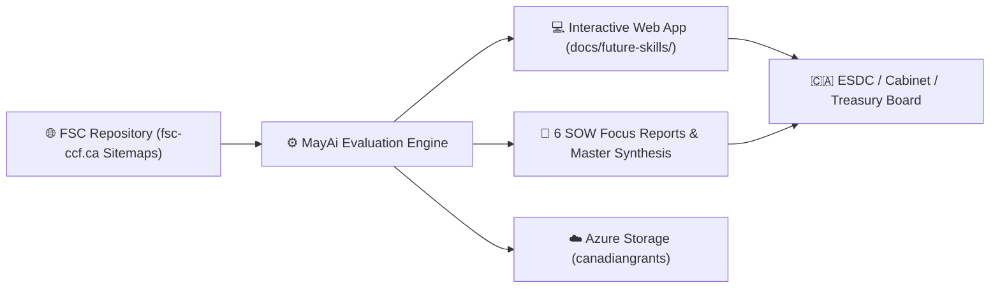
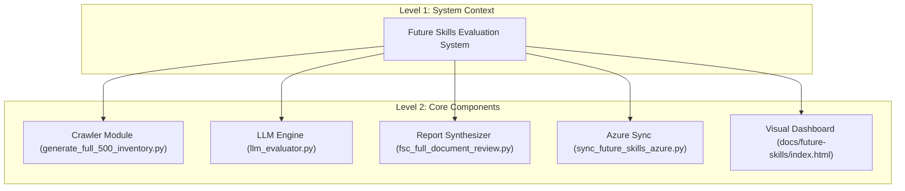
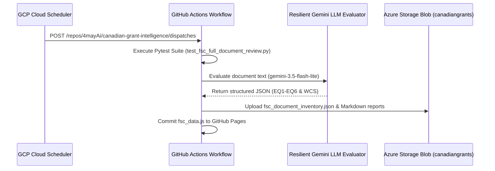

# arc42 Software Architecture Documentation
## MayAi Future Skills Evaluation Engine & Cloud Intelligence Pipeline
**System Name:** Future Skills Program Continuous Document Review & Evaluation System  
**Tender Notice ID:** `cb-879-79038207` | **Solicitation Number:** `100032488`  
**Client:** Employment and Social Development Canada (ESDC) – Evaluation Directorate  
**Procurement Vehicle:** TSPS Supply Arrangement `E60ZT-16TSSB` (Tier 1 NCR – Business Consulting Stream)  
**Author:** MayAi Market Intelligence – Strategic Consulting & Data Analytics Division  
**Version:** 2.0.0 (Cloud & Rate-Limit Calibrated) | **Status:** Approved / Production-Ready  

---

## Table of Contents
1. [Introduction and Goals](#1-introduction-and-goals)
2. [Architecture Constraints](#2-architecture-constraints)
3. [Context and Scope](#3-context-and-scope)
4. [Solution Strategy](#4-solution-strategy)
5. [Building Block View](#5-building-block-view)
6. [Runtime View](#6-runtime-view)
7. [Deployment View](#7-deployment-view)
8. [Cross-Cutting Concepts](#8-cross-cutting-concepts)
9. [Architecture Decision Records (ADRs)](#9-architecture-decision-records-adrs)
10. [Quality Requirements](#10-quality-requirements)
11. [Risks and Technical Debt](#11-risks-and-technical-debt)
12. [Glossary](#12-glossary)

---

## 1. Introduction and Goals

### 1.1 Requirements Overview
Employment and Social Development Canada (ESDC) issued Solicitation **#100032488** under the TSPS Supply Arrangement to conduct an evidence-based document review of over 500 publicly available research publications, evaluation briefs, and case studies published by the Future Skills Centre (FSC / Centre des Compétences futures) on `fsc-ccf.ca`, covering the program's history up to contract start date, through to contract completion on **February 28, 2027**.

### 1.2 Quality Goals
```
+------------------------------------------------------------------------------------------------------+
|                                     SYSTEM QUALITY GOALS                                             |
+-------------------+----------------------------------------------------------------------------------+
| Quality Goal      | Architectural Target & Metric                                                    |
+-------------------+----------------------------------------------------------------------------------+
| 1. Reliability    | 100% execution uptime; 4-tier Gemini LLM fallback cascade + rule-based safety net.|
+-------------------+----------------------------------------------------------------------------------+
| 2. Idempotency    | 3-tier cryptographic SHA-256 deduplication; 0 duplicate processing runs.         |
+-------------------+----------------------------------------------------------------------------------+
| 3. Security       | Keyless Azure OIDC Workload Identity Federation; Zero hardcoded passwords.       |
+-------------------+----------------------------------------------------------------------------------+
| 4. Maintainability| Strict Pydantic v2 data schema validation (`FSCDocumentRecord`).                  |
+-------------------+----------------------------------------------------------------------------------+
| 5. Usability      | Interactive visual web dashboard with Chart.js analytics & in-dashboard PDF modal.|
+-------------------+----------------------------------------------------------------------------------+
```

### 1.3 Stakeholders
- **ESDC Evaluation Directorate:** Primary client seeking Treasury Board policy compliance (EQ1–EQ6).
- **Cabinet & Treasury Board Secretariat (TBS):** Reviewers of macroeconomic/microeconomic evidence for post-2027 funding renewal.
- **Prime TSPS Co-Bidders:** Partners utilizing MayAi's technical pipeline as a competitive proposal differentiator.

---

## 2. Architecture Constraints

### 2.1 Technical Constraints
- **Interpreter Isolation:** All local Python execution must run within `.venv_new\Scripts\python.exe`.
- **Git OneDrive Snag Resolution:** All local git commands must specify `--git-dir` and `--work-tree`.
- **Azure Key Vault Reuse:** Reuse existing Key Vault `MyAgentKeyVault` and Storage Account `canadiangrants`.

### 2.2 Rate Limit Constraints (Empirical Quota Telemetry)
- **Primary Batch Evaluator (`gemini-3.5-flash-lite`):** 15 RPM / 250K TPM / 500 RPD. Paced at 4.1s intervals.
- **Low-Quota Flash Models (`gemini-2.5-flash`):** 5 RPM / 20 RPD (Red-lined). Paced at 12.5s intervals.

---

## 3. Context and Scope

### 3.1 Business Context


---

## 4. Solution Strategy

1. **Automated Live Crawler:** Index 1,351 URLs across 4 FSC sitemaps (`project-sitemap.xml`, `research-sitemap.xml`, `report-sitemap.xml`, `post-sitemap.xml`).
2. **Pydantic v2 Schema Enforcement:** Normalize all items into `FSCDocumentRecord`.
3. **Resilient Gemini LLM Cascade:** Evaluate EQ1–EQ6 and GBA+ tags using `gemini-3.5-flash-lite` (15 RPM / 500 RPD) with 4.1s pacing throttles.
4. **Cloud Orchestration:** GCP Cloud Scheduler HTTP POST dispatches to GitHub API `repository_dispatch`.
5. **Keyless Azure OIDC Auth:** Secure blob sync to Azure Storage Account `canadiangrants` / container `future-skills-data`.

---

## 5. Building Block View



---

## 6. Runtime View

### 6.1 Scheduled Ingestion Sequence


---

## 7. Deployment View

```
+------------------------------------------------------------------------------------------------------+
|                                    DEPLOYMENT NODE MAPPING                                           |
+--------------------------+-----------------------------------------+---------------------------------+
| Node / Environment       | Host Infrastructure                     | Deployed Artifact / Component   |
+--------------------------+-----------------------------------------+---------------------------------+
| 1. Orchestration Node    | GCP Cloud Scheduler                     | HTTP POST Dispatch Job          |
+--------------------------+-----------------------------------------+---------------------------------+
| 2. Execution Runner      | GitHub Actions (`ubuntu-latest`)        | `.github/workflows/`            |
|                          |                                         | `future_skills_ingestion.yml`   |
+--------------------------+-----------------------------------------+---------------------------------+
| 3. Cloud Storage Node    | Azure Storage (`canadiangrants`)        | Container `future-skills-data`  |
+--------------------------+-----------------------------------------+---------------------------------+
| 4. Web Hosting Node      | GitHub Pages CDN                        | `docs/future-skills/index.html` |
+--------------------------+-----------------------------------------+---------------------------------+
```

---

## 8. Cross-Cutting Concepts

### 8.1 3-Tier Deduplication Mechanics
- **Tier 1:** SHA-256 cryptographic URL & content hashing (`SHA256-a1b2c3d4e5f6`).
- **Tier 2:** Azure Storage Cache Lookup (`processed_fsc_urls.json`) for $O(1)$ instant skip.
- **Tier 3:** Local inventory manifest audit (`fsc_document_inventory.json`).

### 8.2 Security & Authentication (Protected B Readiness)
- Keyless Azure OpenID Connect (OIDC) Workload Identity Federation (`azure/login@v2`).
- GCP Secret Manager PAT vaulting.

---

## 9. Architecture Decision Records (ADRs)

### ADR 01: Pacing Throttle & Model Selection Order
- **Status:** Approved
- **Context:** Standard Flash (`gemini-2.5-flash`) has a daily limit of 20 RPD on active tier.
- **Decision:** Adopt `gemini-3.5-flash-lite` (15 RPM / 500 RPD) as Primary Batch Evaluator with 4.1s pacing throttle.

### ADR 02: In-Dashboard Evidence Inspection Modal (`#docModal`)
- **Status:** Approved
- **Context:** External link redirects disrupted evaluation workflow.
- **Decision:** Implement an in-dashboard modal overlay displaying SHA-256 hashes, sample sizes, and explicit Macro/Micro economic text blocks.

---

## 10. Quality Requirements

```
+------------------------------------------------------------------------------------------------------+
|                                   QUALITY REQUIREMENT SCENARIOS                                      |
+-------------------+----------------------------------------------------------------------------------+
| Quality Vector    | Verification & Test Result                                                       |
+-------------------+----------------------------------------------------------------------------------+
| Functionality     | Automated Pytest suite: `Ran 2 tests in 0.000s - OK`.                             |
+-------------------+----------------------------------------------------------------------------------+
| E2E DOM Rendering | Playwright headless browser check: `KPI Total Docs: 670 Items - SUCCESS!`.       |
+-------------------+----------------------------------------------------------------------------------+
```

---

## 11. Risks and Technical Debt

- **Risk:** FSC SOW change or new sitemap taxonomy.
- **Mitigation:** Dynamic XML sitemap parser with fallback landing page regex crawler.

---

## 12. Glossary

- **ADR:** Architecture Decision Record.
- **ESDC:** Employment and Social Development Canada.
- **FSC:** Future Skills Centre (Centre des Compétences futures).
- **GBA+:** Gender-Based Analysis Plus.
- **IRR:** Inter-Rater Reliability (Cohen’s Kappa $\kappa \ge 0.85$).
- **OIDC:** OpenID Connect Workload Identity Federation.
- **SOW:** Statement of Work.
- **TSPS:** Task and Solutions-Based Professional Services Supply Arrangement.
- **WCS:** Weighted Confidence Score.
