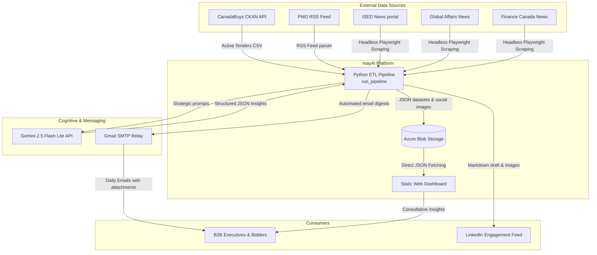
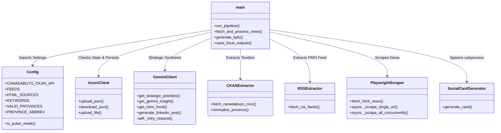
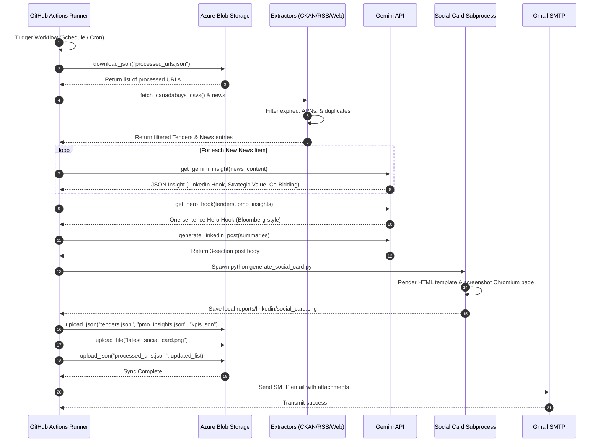

# Architecture Design Document: Canadian Grant Intelligence (mayAi)
## System Architecture using the arc42 Framework

This document provides a comprehensive overview of the architecture of the **Canadian Grant Intelligence (mayAi)** platform using the **arc42 framework**. The platform aggregates, sanitizes, and synthesizes Canadian federal grant opportunities, procurement RFPs, and government policy signals into high-fidelity actionable intelligence for B2B executives and bid managers.

---

## 1. Introduction and Goals

The system addresses the friction of monitoring federal procurement in Canada. By shifting from a manual, scattered review process to an automated, AI-driven, and unified intelligence flow, mayAi enables companies to discover strategic bidding opportunities and prepare consortiums early.

### Quality Goals
1. **Data Integrity**: Accurate data cleaning, duplication filtering, and province mapping. Routine announcements and noise must be automatically filtered.
2. **Operational Resilience (Zero-Persistence Execution)**: The pipeline runs statelessly in ephemeral compute environments (GitHub Actions) and maintains state through secure remote cloud databases (Azure Blob Storage).
3. **JSON-First UI Performance**: The frontend retrieves static pre-synthesized JSON datasets directly from edge CDNs, eliminating latency and avoiding expensive runtime database query overhead.
4. **LLM Cost & Rate-Limit Management**: Throttled requests and robust exponential backoff preserve API quota with zero loss of critical strategic signal.

---

## 2. Context and Boundaries

The context view defines the system boundaries and describes the external interfaces through which the Canadian Grant Intelligence pipeline interacts with data sources, users, and infrastructure.

### 2.1 Business Context

The system operates as an intermediary between raw federal public feeds and B2B professionals. 



### 2.2 Technical Interfaces and Boundaries

The platform integrates with five external systems. All communications are outbound and unidirectional from the perspective of the core pipeline:

| Interface | Protocol / Mechanism | Data Format | Authentication | Description |
| :--- | :--- | :--- | :--- | :--- |
| **CanadaBuys CKAN API** | HTTPS GET | JSON (Metadata) & CSV (Tenders list) | None (Public) | Discovers and streams active and new federal RFP/tender notice datasets. |
| **PMO RSS Feed** | HTTPS GET | XML (RSS 2.0 via `feedparser`) | None (Public) | Pulls policy and diplomatic announcements directly from the Prime Minister. |
| **Federal HTML Feeds** (ISED, GAC, Finance) | Headless Browser Automation (Playwright) | JS-Rendered HTML | None (Public) | Scrapes modern JavaScript-rendered government portals to extract strategic priorities. |
| **Gemini AI API** | HTTPS POST (`/v1/models/gemini-2.5-flash-lite:generateContent`) | JSON (Structured payload) | API Key (`GEMINI_API_KEY`) | Synthesizes target sectors, B2B co-bidding suggestions, and custom hooks. |
| **Azure Blob Storage** | Azure REST Protocol (via SDK) | JSON / PNG / UTF-8 | Connection String (`AZURE_STORAGE_CONNECTION_STRING`) | Houses persistent system datasets, processed URL registries, and visual social cards. |
| **Gmail SMTP Server** | SMTPS (Port 465) | MIME Multipart Email | Username + App Password (`EMAIL_ADDRESS`, `EMAIL_APP_PASSWORD`) | Relays high-fidelity daily briefings and attachments directly to subscribers. |

---

## 3. Building Block View

The building block view outlines the internal structure of the software, decomposing it into reusable packages and services.



### 3.1 Level 1 Decomposition

#### 3.1.1 Core Python Scraper Pipeline (`scripts/src/`)
* **`main.py` (Orchestrator)**: Controls execution states (`pulse`, `DEEP_DIVE`, `seed_strategy`), handles lookback offsets, initializes and coordinates extractors, executes Gemini completions, and manages state protection in standard Python `finally` structures.
* **`config.py` (Configuration Repository)**: Centralized catalog containing:
  - Whitelisted keyword dictionaries for high-impact filtering (e.g. `clean tech`, `indigenous`, `quantum`, `cybersecurity`).
  - Strict geographic mappings resolving nested raw text locations (e.g., "Ottawa") to normalized delivery provinces (e.g., "Ontario").
  - Province abbreviations mappings ensuring perfect representation on the client side (e.g., `Multiple Provinces` -> `MULT`).
* **`models.py` (Data Models)**: Formally defines strongly-typed dataclasses for system objects: `Tender`, `GeminiInsight`, `PMOWrapper`, and `KPI`.

#### 3.1.2 Specialized Extraction Layer (`scripts/src/extractors/`)
* **`ckan.py` (CanadaBuys Parser)**: Fetches remote CSV resources from the CKAN registry. Evaluates row-level data iteratively, performs regex cleaning to discard pre-solicitation files (APNs), matches target keywords, and validates date bounds.
* **`rss.py` (RSS Parser)**: Uses the `feedparser` utility to fetch and ingest structured Prime Minister news feeds.
* **`playwright_scraper.py` (Modern Web Scraper)**: Leverages `asyncio` and `playwright` chromium engines to execute headless web queries. Implements a thread-safe `Semaphore(3)` constraint to scrape modern federal portals without crashing server nodes.

#### 3.1.3 Cognitive & Storage Clients (`scripts/src/api/`)
* **`gemini_client.py` (AI Interface)**: Wraps communication with the Google Gemini API. Enforces modern `responseMimeType: "application/json"` rules, manages structured prompts for sector classification, B2B hooks, and co-bidding suggestions. Employs robust exponential backoff sequences to prevent `429 Rate Limit` issues.
* **`azure_client.py` (Storage Interface)**: Connects to the `data` container inside Azure Blob Storage. Coordinates atomic writes and parses payloads cleanly, enabling complete persistence of the pipeline state between executions.

#### 3.1.4 Social Asset Generator (`scripts/`)
* **`generate_social_card.py`**: A dedicated utility invoked by the main orchestrator. It loads an HTML visual card template (`scripts/templates/social_card.html`), injects the generated Gemini "Hero Hook" and top sectors via JavaScript execution inside a Chromium runtime, and captures a high-resolution 1200x627 PNG asset.

#### 3.1.5 Reactive Web Interface (`docs/`)
* **`index.html` & `style.css`**: A premium, slate-themed, fully responsive static web dashboard. Employs modern Outfit and Inter typographies. Directs fetch queries to Azure raw blob endpoints to pull down precompiled payloads (`tenders.json`, `pmo_insights.json`, `kpis.json`). Renders rich, sortable tables, reactive geographic summaries, and a toggleable "Executive Mode" that highlights critical immediate bidding targets.

---

## 4. Runtime View

This view describes how components interact dynamically during key execution scenarios.

### 4.1 Scenario 1: Automated Daily ELT Pipeline Run (Scheduled at 22:00 UTC)



### 4.2 Scenario 2: Reactive User Dashboard Navigation

```mermaid
sequenceDiagram
    autonumber
    actor User as B2B User / Bidder
    participant Browser as User Web Browser
    participant CDN as Azure Blob CDN

    User->>Browser: Open https://4mayAi.github.io/canadian-grant-intelligence/
    Browser->>Browser: Load static index.html, style.css, and app.js
    
    Browser->>CDN: Fetch kpis.json
    CDN-->>Browser: Return overall stats & Hero Hook
    Browser->>Browser: Render Hero banner and top summary widgets

    Browser->>CDN: Fetch tenders.json
    CDN-->>Browser: Return active tenders array
    Browser->>Browser: Extract geographic metadata, calculate Provincial Split (%)

    Browser->>CDN: Fetch pmo_insights.json
    CDN-->>Browser: Return LinkedIn articles & PMO news cards

    Browser->>Browser: Render default "CanadaBuys Tenders" tab view
    
    alt User Toggles "Executive Mode"
        User->>Browser: Click Executive Toggle switch
        Browser->>Browser: Apply CSS transition classes (.executive-theme)
        Browser->>Browser: Filter out stale items; keep only "New" and those closing in <= 14 days
        Browser->>Browser: Render high-priority red/yellow highlighted cards
    end
```

---

## 5. Deployment View

The deployment view maps the software components to physical or cloud-based host nodes.

```mermaid
node Diagram
    subgraph GitHub Cloud [GitHub Infrastructure]
        node ActionsRunner [GitHub Actions Runner <br> Ubuntu VM] {
            component ETL[ELT Python Pipeline]
            component PlaywrightChromium[Playwright Headless Browser]
        }
        node GitRepo [GitHub Repository <br> 4mayAi/canadian-grant-intelligence] {
            component Pages[GitHub Pages CDN]
        }
    end

    subgraph Azure Cloud [Microsoft Azure West Europe/East US]
        node BlobStorage [Azure Blob Storage <br> Public Container: data] {
            artifact TendersJson[tenders.json]
            artifact PmoJson[pmo_insights.json]
            artifact KpisJson[kpis.json]
            artifact ProcessedUrls[processed_urls.json]
            artifact SocialCards[social_card_*.png]
        }
    end

    subgraph SMTP Relay [Gmail Infrastructure]
        node SMTPHost [smtp.gmail.com <br> Port 465]
    end

    subgraph Client Device [User Workspace]
        node BrowserNode [User Desktop/Mobile Browser]
    end

    %% Deployment channels
    ETL -->|Execute Web Screenshots| PlaywrightChromium
    ETL -->|Sync Static Datasets via Sdk| BlobStorage
    ETL -->|Push Run Metrics & Local reports| GitRepo
    ETL -->|Relay email digests| SMTPHost
    
    Pages -->|Serve UI Assets| BrowserNode
    BlobStorage -->|Read Raw JSON Endpoints| BrowserNode
```

### 5.1 Host Nodes & Runtime Environments

1. **GitHub Actions Hosted Runner (`ubuntu-latest`)**:
   - **Characteristics**: Ephemeral virtual machine launched on schedule or event triggers. Serves as the high-throughput computing node.
   - **Software Stack**: Python 3.10, `pip` package manager, Playwright Chromium binaries, and system libraries.
   - **Data Persistence**: Zero storage persistence. All files are wiped at run completion.
2. **Azure Blob Storage (Blob Endpoints)**:
   - **Characteristics**: High-durability object storage service. Configured with public read permissions on the `data` container.
   - **Role**: Serves as the static data lake and system state database.
3. **GitHub Pages CDN**:
   - **Characteristics**: Geographically distributed static hosting edge CDN.
   - **Role**: Hosts and serves the frontend dashboard files directly to users.
4. **Gmail SMTP Gateway (`smtp.gmail.com`)**:
   - **Characteristics**: Highly secure authentication gateway.
   - **Role**: Relays strategic briefing emails directly to user mailboxes.

### 5.2 System Credentials and Secure Parameters

System secrets are isolated from the codebase and injected directly as runtime environment variables on the execution runner:

* `GEMINI_API_KEY`: Secure token permitting connection to Google's LLM generation engine.
* `AZURE_STORAGE_CONNECTION_STRING`: Connection registry string authorizing data updates on the Azure storage account.
* `EMAIL_ADDRESS` & `EMAIL_APP_PASSWORD`: SMTP authorization parameters allowing workflow steps to distribute mail.

---

## 6. Architecture Decisions & Known Limitations

### 6.1 Key Architectural Decisions

1. **Zero-Persistence Infrastructure**: Avoids the complexity and expense of maintaining 24/7 relational database engines. Compute runs on-demand in GHA, and persistent storage is offloaded to simple cloud file buckets.
2. **Direct Azure Blob Client Path**: The web browser fetches data directly from Azure Blob Storage. This bypasses the GitHub API, preventing `403 Rate Limit` blocks that occur when high traffic queries raw repository pages.
3. **Client-Side Heavy Processing**: Geographic normalizations, provincial percentage splits, filters, and sorting algorithms execute entirely in the user's browser via high-performance vanilla JavaScript. This reduces processing requirements on the back-end and makes the dashboard highly responsive.

### 6.2 API Consumption & Resilience Architecture

To protect against infrastructure limitations—specifically Google API quota ceilings (`429 Too Many Requests`)—the pipeline integrates several architectural safeguards:

1. **Algorithmic Pacing (Throttling)**: The extraction orchestrator enforces strict geometric pacing (e.g., rigid `time.sleep` intervals) to guarantee execution requests mathematically never exceed the primary model's Requests Per Minute (RPM) ceiling (e.g., 15 RPM).
2. **Batch Processing Pipelines**: To aggressively protect low RPM limits while maximizing high Tokens Per Minute (TPM) limits, input text (such as news feeds) is grouped and transmitted in unified batch arrays. The model enforces structured JSON output schemas to return parallel arrays of insights.
3. **Model Waterfall (Fallback Strategy)**: The `GeminiClient` implements a tiered routing pattern. If a primary endpoint (`gemini-2.5-flash-lite`) is saturated or completely exhausted its daily RPD quota, the client traps the exception and dynamically pivots the payload to an equivalent secondary endpoint (`gemini-3.1-flash-lite`), which maintains a completely isolated quota bucket.

### 6.3 Identified Gaps & Blanks (To Be Completed in Future Sessions)

1. **Stale Historical Report View**:
   * *Status*: Identified as **[DEPRECATED/INCOMPLETE]** in `index.html` (Lines 441–444). Historical archive lookups are currently bypassed, only displaying the latest crawled daily update. A future session needs to structure a manifest array or implement Azure Blob directory listing to allow historic date navigation.
2. **Scraper Error Alerts**:
   * *Status*: **[MISSING]**. While standard pipeline crashes fail the GitHub Action job, there is currently no immediate communication hook (e.g. Slack, Discord, or SMS) alert notifying the operator if the CanadaBuys CSV structure shifts and breaks parsing.
3. **Multi-Recipient Email Distribution**:
   * *Status*: **[TO BE EXPANDED]**. The Gmail SMTP step currently sends only to the operator's primary email. An external subscription database or mailing list manager has not yet been integrated.
