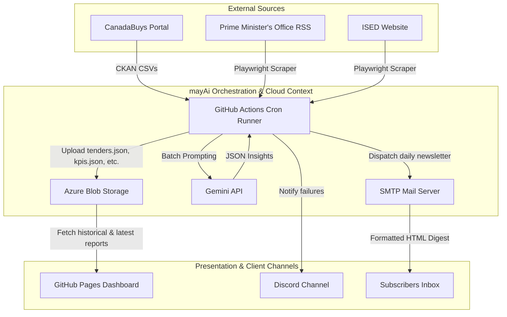
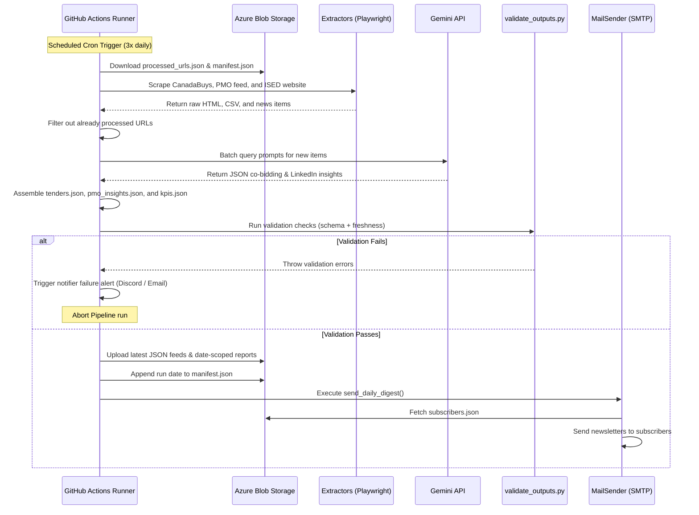

# Canadian Grant Intelligence 2.0 — arc42 Architecture Documentation

This document describes the software architecture of the Canadian Grant Intelligence platform version 2.0 (mayAi).

---

## 1. Introduction and Goals

### 1.1 Requirements Overview
The Canadian Grant Intelligence platform (mayAi) is a high-fidelity monitoring and synthesis pipeline. It continuously scrapes federal and provincial procurement portals, grant databases, and political communication channels to deliver daily intelligence digests to business analysts, co-bidders, and decision-makers.

Key features:
- Scrapes CanadaBuys CSV databases, ISED feed, Finance Canada, and the PMO announcement feeds.
- Synthesizes complex regulatory updates into strategic hooks using LLMs.
- Publishes daily reports to public dashboards and automatically distributes formatted HTML newsletters to email subscribers.

### 1.2 Quality Goals
1. **Robusness & Reliability**: Zero silent errors. All execution failures must trigger immediate alerting via Discord Webhooks and SMTP.
2. **Data Consistency**: Automated output validation using schema checks and freshness controls prevents corrupt or empty reports from corrupting the production dashboard.
3. **Auditable Archives**: Complete execution history, enabling historical date browsing through date-scoped reports in Azure Blob Storage.
4. **Environment Isolation**: Standardized execution via Docker containers, eliminating host dependency differences and Playwright startup snags.

### 1.3 Stakeholders & Personas
- **Operational Administrator**: Needs visibility into scraping statuses, rate-limit failures, and SMTP dispatch failures.
- **B2B Co-bidder**: Requires access to synthesized LinkedIn posts and strategic recommendations to form bidding consortiums.
- **Business Advisor / Subscriber**: Expects a clean, daily, morning email containing actionable grants and RFPs.

---

## 2. Architecture Constraints

- **Execution Context**: The scraper pipeline must run inside a containerized job on the cloud to avoid local execution issues and rate limits.
- **Persistence**: Zero-database local persistence; all state management (tenders lists, processed URLs, subscriber indexes) relies on Azure Blob Storage JSON files.
- **Frontend Constraints**: Static HTML/CSS/JS frontend hosted on GitHub Pages with zero server-side compilation, pulling data asynchronously from Azure.

---

## 3. System Context and Templates



---

## 4. Solution Strategy

The platform orchestrates the high-fidelity intelligence pipeline via scheduled GitHub Actions cron runners executing 3x daily (10:00 AM, 2:00 PM, and 6:00 PM EDT). The Azure Container Apps Job is kept on standby as an manual override option to ensure operational resilience and zero infrastructure loss.

Key strategies include:
- **Playwright Integration**: Running headless Chromium directly inside the GitHub Actions virtual runner using built-in caching for fast startup times.
- **Incremental Scraping**: Maintaining state via `processed_urls.json` in Azure to scrape and synthesize only new announcements.
- **Date-Scoped Historical Partitioning**: Backing up each day's run to `reports/tenders_YYYY-MM-DD.json` and indexing dates in `manifest.json`.

---

## 5. Building Block View

### 5.1 Scraper Pipeline Components (scripts/src/)

```
scripts/src/
├── main.py                    # Orchestrates extraction, analysis, validation, and upload
├── config.py                  # Environment parsing and global configurations
├── extractors/
│   ├── ckan.py                # Interacts with CanadaBuys CKAN API for CSV files
│   ├── rss.py                 # Fetches and parses RSS feeds
│   └── playwright_scraper.py  # Handles dynamic pages via headless Playwright
├── models.py                  # Dataclass schemas for Tenders, Insights, and KPIs
└── api/
    ├── azure_client.py        # Wrapper for Azure Blob Storage operations
    ├── gemini_client.py       # Batch querying wrapper for Gemini LLM
    ├── notifier.py            # Failure notification handler (Discord + Email)
    └── mail_sender.py         # Subscriptions digest and HTML newsletter compiler
```

- **main.py**: The orchestrator. Coordinates the scraping, calls LLM synthesis, triggers the output validator, uploads results to Azure, and coordinates the subscriber email broadcast.
- **validate_outputs.py**: Validates schemas and age freshness prior to cloud uploading.
- **notifier.py**: Handles error alerts, pushing embedded Markdown reports to Discord webhooks and plain-text SMTP warnings to administrators.
- **mail_sender.py**: Downloads the active subscriber index (`subscribers.json`) and runs individual SMTP runs containing the daily HTML digest and social card attachment.

---

## 6. Runtime View

### 6.1 Daily Orchestration Flow



### 6.2 PMO News & Insights Data Flow

The "PMO News & Insights" dashboard tab is generated through a 4-phase pipeline:
1. **Extraction**: `main.py` orchestrates `rss.py` and `playwright_scraper.py` to ingest new announcements from government domains, bypassing items already stored in `processed_urls.json`.
2. **AI Synthesis**: Batches of unstructured news texts are transmitted to the `gemini_client.py` where the LLM extracts actionable hooks. A macroeconomic summary is then synthesized into a daily LinkedIn post.
3. **Cloud Storage**: The insights and the markdown-formatted LinkedIn post are packaged into a JSON wrapper and pushed to Azure Blob Storage as `pmo_insights.json`, operating entirely without a relational database.
4. **Client-Side Rendering**: When the frontend tab is activated, vanilla JavaScript in `index.html` asynchronously fetches `pmo_insights.json` from Azure. The payload is mapped directly to the DOM, parsing the Markdown via `marked.js` and expanding individual insights into `<details>` accordion cards.

---

## 7. Deployment View

- **Pipeline Execution**: The daily pipeline is scheduled via GitHub Actions crons. It runs directly inside Ubuntu-latest runner environments, leveraging Playwright caching to ensure rapid and deterministic browser execution.
- **Standby Container Job**: The Azure Container App Job configuration, Dockerfile, and container image are preserved in a dormant status. The trigger type is configured to `Manual` to prevent redundant billing while keeping the containerized path immediately ready for re-activation.
- **Frontend Hosting**: Static GitHub Pages site resolves requests using raw JSON paths from the public Azure Blob container URL.

---

## 8. Concepts

### 8.1 Automated Data Verification
The system enforces strict data verification. If any check fails inside `validate_outputs.py`, the pipeline execution is immediately aborted, protecting the production dashboard from corrupted states:
- **File Completeness**: Verifies presence of `tenders.json`, `pmo_insights.json`, and `kpis.json`.
- **JSON Structure**: Assures structural format constraints (e.g. tenders root is an Array; KPIs are typed Integers and Strings).
- **Freshness Control**: Checks the KPI `generated_at` timestamp. If the runtime is older than the configured threshold (e.g. 2 hours), the run is aborted.

---

## 9. Design Decisions

- **Zero-Database JSON Architecture**: Storing structured datasets as raw JSON files in Azure Blob allows the frontend to run entirely serverless, reducing maintenance costs.
- **State-Based Date Dropdown**: Storing historical run dates in a simple sorted array in `manifest.json` enables the frontend to lazily load and present a dropdown list of historical dates without hitting API rate limits.
- **Individual SMTP Dispatching**: Sending individual emails rather than CC-ing subscribers prevents recipient email leakage and aligns with privacy regulations.
- **Algorithmic Pacing (Throttling)**: The extraction orchestrator enforces strict geometric pacing to guarantee execution requests mathematically never exceed the primary model's Requests Per Minute (RPM) ceiling (e.g., 15 RPM).
- **Batch Processing Pipelines**: To aggressively protect low RPM limits while maximizing high Tokens Per Minute (TPM) limits, input text is grouped and transmitted in unified batch arrays. The model enforces structured JSON output schemas to return parallel arrays of insights.
- **Model Waterfall (Fallback Strategy)**: The LLM client implements a tiered routing pattern. If a primary endpoint (`gemini-2.5-flash-lite`) is saturated or exhausts its daily RPD quota, the client traps the exception and dynamically pivots the payload to an equivalent secondary endpoint (`gemini-3.1-flash-lite`), which maintains a completely isolated quota bucket.
