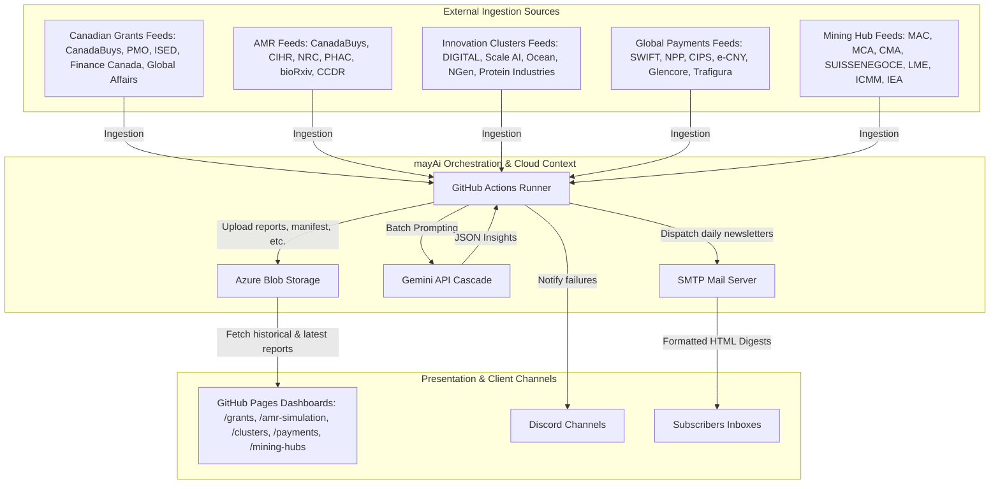
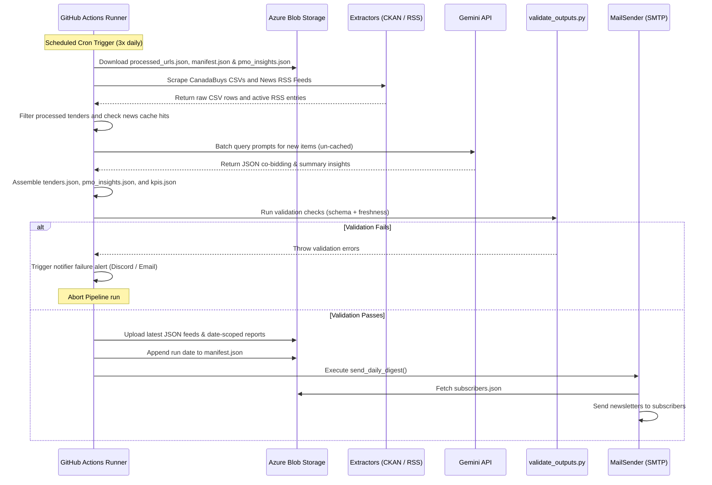

# Canadian Grant Intelligence 2.0 — arc42 Architecture Documentation

This document describes the software architecture of the Canadian Grant Intelligence platform version 2.0 (mayAi).

---

## 1. Introduction and Goals

### 1.1 Requirements Overview
The Canadian Grant Intelligence platform (mayAi) is a high-fidelity monitoring and synthesis pipeline. It continuously scrapes federal and provincial procurement portals, grant databases, political communication channels, and international mining reports to deliver daily intelligence digests to business analysts, co-bidders, and decision-makers.

Key features:
- **Canadian Grants**: Scrapes CanadaBuys CSV databases, ISED feed, Finance Canada, PMO announcements, and Global Affairs Canada feeds.
- **AMR & Biotech Simulation**: Scrapes CanadaBuys, CIHR, NRC, PHAC, bioRxiv Microbiology, and PHAC CCDR feeds.
- **Innovation Clusters**: Scrapes DIGITAL, Scale AI, Ocean Cluster, NGen, and Protein Industries news, ecosystem, and federal news feeds.
- **Global Payments**: Scrapes ISO 20022/SWIFT, NPP, CIPS, e-CNY, and commodity trade settlement (Glencore, Trafigura) feeds across CA, AU, CN, HK, CH, UK, and Global.
- **Mining Hubs**: Scrapes global mining industry reports and press releases across 5 major hubs (Canada, Australia, China, Switzerland, and the UK) using peak body feeds (MAC, MCA, CMA, SUISSENEGOCE, LME, ICMM, IEA).
- Synthesizes complex regulatory updates into strategic hooks using LLMs.
- Publishes daily reports to public dashboards and automatically distributes formatted HTML newsletters to email subscribers.

### 1.2 Quality Goals
1. **Robustness & Reliability**: Zero silent errors. All execution failures must trigger immediate alerting via Discord Webhooks and SMTP.
2. **Data Consistency**: Automated output validation using schema checks and freshness controls prevents corrupt or empty reports from corrupting the production dashboard.
3. **Auditable Archives**: Complete execution history, enabling historical date browsing through date-scoped reports in Azure Blob Storage using a date manifest architecture.
4. **Environment Isolation**: Standardized execution via Docker containers, eliminating host dependency differences and Playwright startup snags.

### 1.3 Stakeholders & Personas
- **Operational Administrator**: Needs visibility into scraping statuses, rate-limit failures, and SMTP dispatch failures.
- **B2B Co-bidder**: Requires access to synthesized post copy and strategic recommendations to form bidding consortiums.
- **Business Advisor / Subscriber**: Expects a clean, daily, morning email containing actionable grants and RFPs.

---

## 2. Architecture Constraints

- **Execution Context**: The scraper pipeline must run inside a containerized job on the cloud to avoid local execution issues and rate limits.
- **Persistence**: Zero-database local persistence; all state management (tenders lists, processed URLs, subscriber indexes) relies on Azure Blob Storage JSON files.
- **Frontend Constraints**: Static HTML/CSS/JS frontend hosted on GitHub Pages with zero server-side compilation, pulling data asynchronously from Azure.

---

## 3. System Context and Templates



---

## 4. Solution Strategy

The platform orchestrates the high-fidelity intelligence pipeline via scheduled GitHub Actions cron runners executing 3x daily (10:00 AM, 2:00 PM, and 6:00 PM EDT). The Azure Container Apps Job is kept on standby as a manual override option to ensure operational resilience and zero infrastructure loss.

Key strategies include:
- **Agentic Decoupling via Skills Registry**: Decoupling the orchestrator runtime (Generic Engine) from the domain logic (configured as "Skills" consisting of JSON configuration files, prompt templates, and anchors seed datasets). This makes the platform self-describing, enabling autonomous agents to register and run pipelines without modifying the runtime code.
- **Fast RSS/Atom Extraction**: Utilizing lightweight Python RSS feed parsers to read news feeds concurrently, minimizing the pipeline's execution footprint.
- **Playwright Integration**: Running headless Chromium inside the runner environment solely for generating dynamic social card images, utilizing caching for fast startup times.
- **Incremental Scraping**: Maintaining state via `processed_urls.json` in Azure to scrape and synthesize only new tenders.
- **Self-Healing News Cache**: Running news extraction against the active `pmo_insights.json` cache to automatically reuse insights, heal missing items, and prune expired content.
- **Date-Scoped Historical Partitioning**: Backing up each day's run to `reports/tenders_YYYY-MM-DD.json` and indexing dates in `manifest.json`.

---

## 5. Building Block View

### 5.1 Scraper Pipeline Components (generic_engine/)

The scraping and synthesis engine is built as a generic, configuration-driven multi-topic processor:

```
generic_engine/
├── main.py                    # Orchestrates extraction, analysis, validation, and upload
├── schema.py                  # Pydantic schemas validating configs (PipelineConfig)
├── models.py                  # Dataclass schemas for Tenders, Insights, and KPIs
├── extractors/
│   ├── ckan.py                # Interacts with CanadaBuys CKAN API for CSV files
│   ├── rss.py                 # Fetches and parses RSS feeds with dynamic keyword parameters
│   └── playwright_scraper.py  # Headless browser crawler for JS-rendered news feeds
└── api/
    ├── azure_client.py        # Wrapper for Azure Blob Storage with auto-bootstrap checks
    ├── gemini_client.py       # Batch querying wrapper for Gemini LLM
    ├── notifier.py            # Failure notification handler (Discord + Email)
    └── mail_sender.py         # Subscriptions digest and HTML newsletter compiler
```

- **main.py**: The orchestrator. Coordinates feed scraping, deduplication, LLM synthesis, triggers the output validator, compiles date manifests, and uploads reports to Azure Blob storage.
- **schema.py**: Enforces strict configuration schemas (supporting parameters like `manifest_file`, source overrides, and metadata) to allow running different pipelines (Innovation Clusters, Mining Hubs) under the same orchestrator.
- **validate_outputs.py**: Validates schemas and age freshness prior to cloud uploading.
- **notifier.py**: Handles error alerts, pushing embedded Markdown reports to Discord webhooks and plain-text SMTP warnings to administrators.
- **mail_sender.py**: Downloads the active subscriber index (`subscribers.json`) and runs individual SMTP runs containing the daily HTML digest and social card attachment.

### 5.2 Skills Registry Infrastructure

The Skills Registry layer structures pipeline governance:
- **Skill Isolation**: Topic domains are configured as self-contained "Skills" located in `configs/` containing dynamic parameters, target containers, active keywords, and prompt instructions.
- **Anchor Lifecycle Decoupling**: Static reference databases (e.g. `grants_anchors.json`, `hub_anchors.json`) are decoupled from code. The orchestrator tracks and alerts when an anchor fact has exceeded its `review_by` metadata date.
- **Verification Harness**: Standardized diagnostics run via `scripts/validate_skill.py` to ensure new configurations satisfy strict schema parameters prior to deployment.

---

## 6. Runtime View

### 6.1 Daily Orchestration Flow



### 6.2 News & Insights Data Flow (Multi-Topic)

All news and insights dashboard sections (e.g., PMO News, Innovation Clusters, and Global Mining Hubs) are processed dynamically via the config-driven runtime:
1. **Extraction**: `main.py` orchestrates `rss.py` (and standby Playwright scrapers) to ingest new announcements from configured domains (e.g., government feeds for Grants/Clusters, global peak bodies like MAC/MCA/ICMM for Mining Hubs).
2. **Caching & Deduplication**: The active insights file (e.g., `pmo_insights.json` or `mining_insights.json`) acts as the cache. Links in the active feeds are matched against this cache; if found, their insights are reused directly to bypass Gemini. If not, they are passed to the Gemini Client for duplicate clustering and analysis.
3. **AI Synthesis**: Uncached items are packaged and sent to `gemini_client.py` where the LLM resolves strategic value B2B hooks and ESG metrics, grounding the output against the slow-moving anchor database.
4. **Cloud Storage & Manifesting**: The generated insights and executive post are stored in Azure Blob Storage. The run date is compiled into the `manifest.json` file.
5. **Client-Side Historical Rendering**: When the user changes the "Archive" dropdown in the static dashboard UI, vanilla JavaScript dynamically fetches the manifest, resolves the date-scoped JSON paths from Azure, and updates the layout dynamically.

---

## 7. Deployment View

- **Pipeline Execution**: The daily pipeline is scheduled via GitHub Actions crons. It runs directly inside Ubuntu-latest runner environments, leveraging Playwright caching to ensure rapid and deterministic browser execution (for social card generation).
- **Standby Container Job**: The Azure Container App Job configuration, Dockerfile, and container image are preserved in a dormant status. The trigger type is configured to `Manual` to prevent redundant billing while keeping the containerized path immediately ready for re-activation.
- **Frontend Hosting**: Static GitHub Pages site resolves requests using raw JSON paths from the public Azure Blob container URL.

---

## 8. Concepts

### 8.1 Automated Data Verification
The system enforces strict data verification. If any check fails inside `validate_outputs.py`, the pipeline execution is immediately aborted, protecting the production dashboard from corrupted states:
- **File Completeness**: Verifies presence of `tenders.json`, `pmo_insights.json`, and `kpis.json`.
- **JSON Structure**: Assures structural format constraints (e.g. tenders root is an Array; KPIs are typed Integers and Strings).
- **Freshness Control**: Checks the KPI `generated_at` timestamp. If the runtime is older than the configured threshold (e.g. 2 hours), the run is aborted.

---

## 9. Design Decisions

- **Zero-Database JSON Architecture**: Storing structured datasets as raw JSON files in Azure Blob allows the frontend to run entirely serverless, reducing maintenance costs.
- **State-Based Date Dropdown**: Storing historical run dates in a simple sorted array in `manifest.json` enables the frontend to lazily load and present a dropdown list of historical dates without hitting API rate limits.
- **Individual SMTP Dispatching**: Sending individual emails rather than CC-ing subscribers prevents recipient email leakage and aligns with privacy regulations.
- **Algorithmic Pacing (Throttling)**: The extraction orchestrator enforces strict geometric pacing to guarantee execution requests mathematically never exceed the primary model's Requests Per Minute (RPM) ceiling (e.g., 15 RPM).
- **Batch Processing Pipelines**: To aggressively protect low RPM limits while maximizing high Tokens Per Minute (TPM) limits, input text is grouped and transmitted in unified batch arrays. The model enforces structured JSON output schemas to return parallel arrays of insights.
- **Model Waterfall (Fallback Strategy)**: The LLM client implements a tiered routing pattern. If a primary endpoint (`gemini-2.5-flash-lite`) is saturated or exhausts its daily RPD quota, the client traps the exception and dynamically pivots the payload to an equivalent secondary endpoint (`gemini-3.1-flash-lite`), which maintains a completely isolated quota bucket.
- **Self-Healing News Cache**: Using the live `pmo_insights.json` file as the cache, allowing missing or corrupted items to automatically heal and old ones to prune natively, bypassing the restrictive `processed_urls.json` filter.
- **Feed Failure Resilience**: Tracking individual RSS feed statuses during parsing. If a feed source fails, the system automatically retains all existing insights in `pmo_insights.json` belonging to that source, preventing data loss due to temporary network or server outages.
- **Self-Healing Storage Bootstrapping**: Azure storage containers (such as `mining-hubs-data`) are verified and dynamically created with public blob access on first pipeline upload. This removes manual container creation tasks and guarantees zero-downtime deployment in new clouds.
- **Shared Multi-Topic Ingestion Architecture**: Standardizing on a generic Pydantic config-driven architecture (`generic_engine/`) rather than individual hardcoded pipelines increases code reuse, ensures consistent telemetry metrics, and eases onboarding of new topic categories.
- **Exclusion of Gemstone & Luxury Hubs**: Specific gemstone trading and extraction hubs (e.g., Antwerp, Botswana, or South American gemstone mines) are excluded due to supply chain divergence (luxury consumer goods vs. industrial green-tech), data feed fragmentation (predominantly artisanal and un-structured ASM mining), and lack of alignment with B2B industrial grant and consortium frameworks.
- **Structured Prompt Decomposition**: Factoring out persona, classification, grounding, translation, and output formatting rules from the monolithic `system_instruction` into structured configuration fields. This enables granular testing, prompt engineering isolation, and prevents LLM drift across runs.
- **Skill Versioning**: Incorporating explicit `skill_version` and `schema_version` fields in KPIs and telemetry outputs to audit pipeline compliance and monitor configuration schema migrations over time.
- **Container-Aware URL Pruning**: Standardizing URL registry pruning into a container-aware task that reads storage targets dynamically from the active Skill's config path, ensuring all pipelines benefit from bounded growth.
