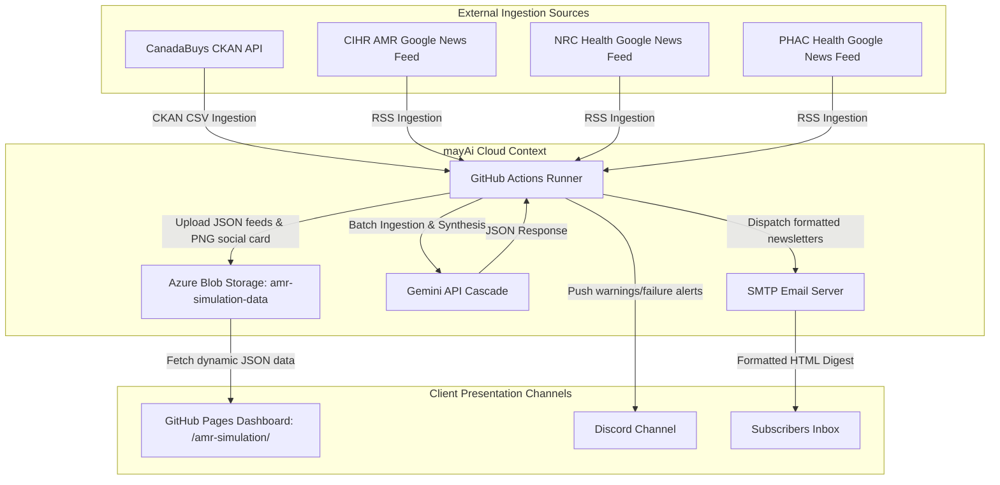
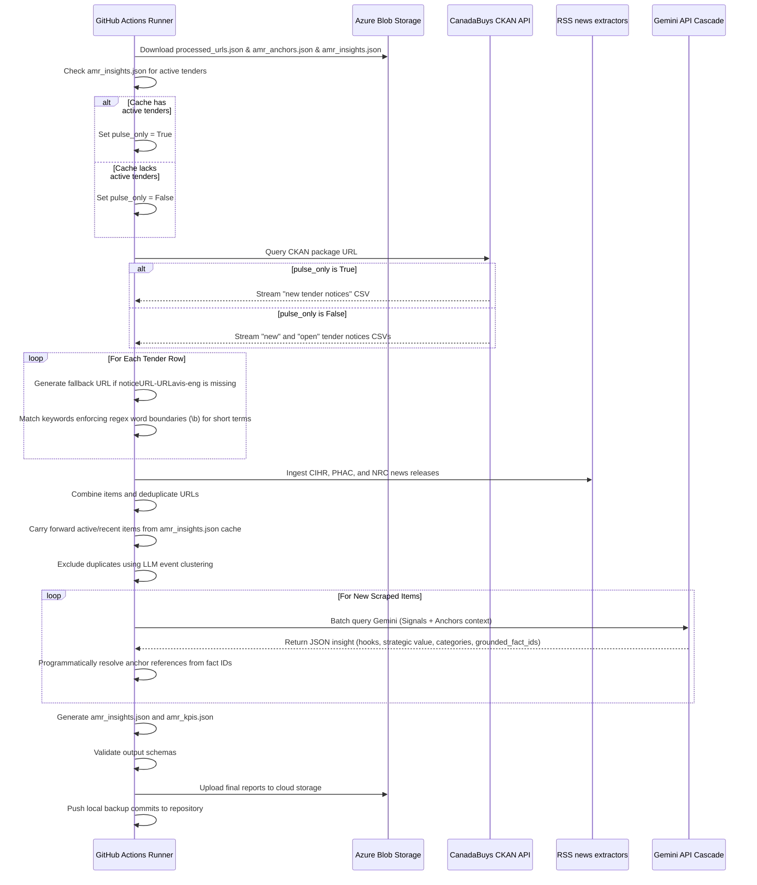

# AMR & Biotech Simulation Intelligence Pipeline — arc42 Architecture Documentation

This document describes the software architecture of the AMR & Biotech Simulation Intelligence Pipeline (mayAi).

---

## 1. Introduction and Goals

### 1.1 Requirements Overview
The AMR & Biotech Simulation Intelligence Pipeline is a serverless, scheduled, config-driven monitoring and synthesis system. It tracks Antimicrobial Resistance (AMR) policies, bacterial and pathogen spread modeling, and biotech R&D procurement opportunities across Canada.

Key features:
- **Direct Database Integration (CKAN API)**: Crawls the live CanadaBuys dataset API to stream and parse tender rows directly, bypassing traditional RSS limitations.
- **Dual-Speed Ingestion**: Integrates slow-moving, long-term biological strategies and regulatory baselines (Anchors) with fast-moving daily news and tender signals (Signals).
- **METS Taxonomy Classification**: Classifies opportunities into three mutually exclusive, collectively exhaustive (MECE) biotech categories: **METS-Digital** (simulation software, modeling), **METS-PMO** (program management, evaluation), and **METS-Ops** (laboratory operations, biosafety, equipment).
- **Precision Keyword Mapping**: Enforces regex word boundaries (`\b`) for short keywords (length $\le 4$) like `AMR`, `NRC`, `CIHR`, and `PHAC` to eliminate false positive matches (e.g., preventing `nrcan` from matching `nrc`).
- **State-Preserving Cache Merging**: Carries forward unexpired open tenders and recent news across scraper executions to keep the dashboard accurate and comprehensive.

### 1.2 Quality Goals
1. **Auditable Reference Traceability**: Every biotech insight grounded in a slow-moving anchor must display a verified reference tracing back to the official health strategy or funding report.
2. **Metadata Integrity**: Preserves and carries forward tender-specific attributes (e.g. closing dates, delivery provinces, categories, and partnering options) from the source database.
3. **Resilience**: The system falls back to generating notice URLs from the reference number if the `noticeURL-URLavis-eng` field is missing, ensuring tenders are not skipped.
4. **Layout Separation**: The frontend dashboard divides active procurement opportunities ("Simulation Tracker") from general news signals ("Biotech Insights") based on the presence of a closing date.

### 1.3 Stakeholders & Personas
- **Biotech Founder / R&D Director**: Uses the *Simulation Tracker* to identify upcoming bids, funding opportunities, and consortia for computational pathology and modeling software.
- **Health-Tech Consultant**: Analyzes the *Biotech Insights* tab for policy signals from WHO, PHAC, and CIHR to align client consulting proposals with national funding priorities.

---

## 2. Architecture Constraints

- **Storage Constraint**: Zero relational database footprint; all state registries (processed URLs, KPIs, curated anchors, insights list) are stored as raw JSON files in Azure Blob Storage under the `amr-simulation-data` container.
- **Serverless Trigger**: Execution runs entirely serverless, triggered daily by GitHub Actions workflow schedulers.
- **Client-Side Rendering**: The dashboard renders dynamically using client-side JavaScript, fetching data directly from Azure Storage.

---

## 3. System Context



---

## 4. Solution Strategy

The pipeline implements three core design strategies to handle the integration of slow and fast data speeds:

1. **Dual-Speed Cross-Synthesis**: Slow-moving biotech anchors are indexed with unique integer Fact IDs in `configs/amr_anchors.json`. When daily signals are scraped, they are grouped by hub, and the matching hub anchors are appended to the Gemini prompt context.
2. **Programmatic Reference Resolution**: The model returns the list of selected integer `grounded_fact_ids`, and the Python script programmatically resolves the source name, page range, and URL from the local anchors database.
3. **METS Biotech Taxonomy**: Gemini classifies insights into the three categories, which the frontend JS parses to map onto standard CSS styles:
   - `METS-Digital` (Pathogen modeling, in silico simulation, data analytics)
   - `METS-PMO` (Program evaluation, consulting, strategy)
   - `METS-Ops` (Laboratory equipment, biosafety operations, diagnostics)

---

## 5. Building Block View

```
generic_engine/
├── main.py                     # Main orchestrator (fetches feeds, groups by hub, calls Gemini, merges cache)
├── models.py                   # Dataclass schemas for Insights and KPIs
├── schema.py                   # Pydantic V2 configuration validator
└── extractors/
    └── ckan.py                 # Direct CanadaBuys CKAN API database crawler

configs/
├── amr_simulation.json         # Ingestion sources, search terms, and model parameters
└── amr_anchors.json            # Local seed database for slow-moving payment anchors

docs/
├── amr-simulation/
│   └── index.html              # Frontend presentation dashboard
└── architecture_arc42_amr_simulation.md # This architecture document
```

---

## 6. Runtime View

### 6.1 Daily Ingestion & Synthesizer Flow


