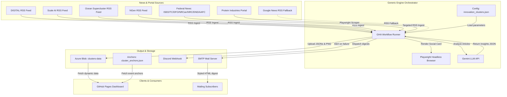
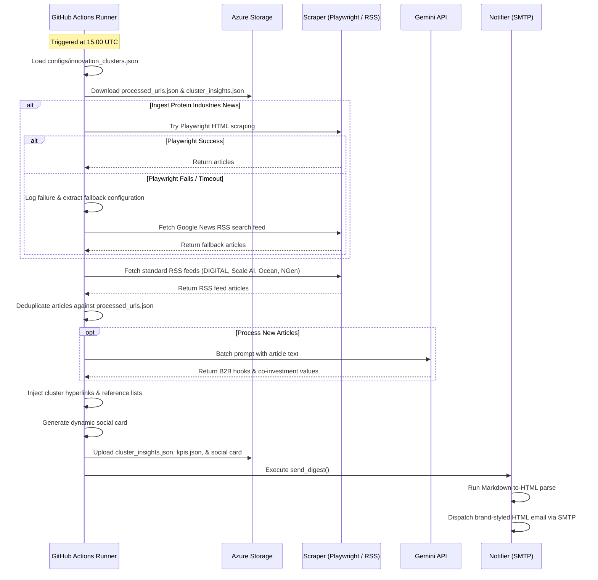

# Global Innovation Clusters Pipeline — arc42 Architecture Documentation

This document describes the software architecture of the Global Innovation Clusters Intelligence pipeline, built using the config-driven Generic Engine (mayAi).

---

## 1. Introduction and Goals

### 1.1 Requirements Overview
The Global Innovation Clusters Pipeline is a specialized intelligence system. It monitors and synthesizes news releases, funding opportunities, and project calls from Canada’s five Global Innovation Clusters:
1. **DIGITAL** (Digital Technology Supercluster)
2. **Scale AI** (Artificial Intelligence Supercluster)
3. **NGen** (Next Generation Manufacturing Canada)
4. **Ocean Supercluster** (Marine Innovation)
5. **Protein Industries Canada** (Agri-food Innovation)

The system automatically parses first-party news portals, identifies strategic B2B leads, synthesizes macroeconomic digests using Gemini, generates social card graphics, and broadcasts styled newsletters.

Key features:
- **Resilient Web Scraping**: Ingests unstructured portal pages using headless Playwright with automated fallbacks to Google News RSS feeds if the portal changes or blocks requests.
- **Federal Ecosystem Ingestion**: Integrates targeted federal department RSS feeds filtered specifically by `/news` subpaths (ISED, Transport Canada, DFO, NRCan, NRC, DND, AAFC) to capture high-value announcements (such as DFO conferences, Transport Canada logistics, and NRCan clean energy/critical minerals releases) without administrative noise.
- **AI-Powered Synthesis**: Batches unstructured news into Gemini to extract LinkedIn hooks, strategic co-investment values, and co-bidding/consortium opportunities.
- **Link Injections & Citations**: Automatically hyper-links cluster text mentions and appends a "Featured News & Sources" reference list to the digests.
- **SMTP Distribution**: Compiles markdown digests into brand-aligned Slate-and-Gold HTML newsletters and mails them via SMTP.
- **Static Dashboard Hosting**: Renders results asynchronously on a public GitHub Pages dashboard using files hosted in Azure Blob Storage.
- **Ecosystem Events & Milestones Deck**: Fetches and renders collapsible, dynamically styled event cards (e.g. summits, webinar series, and the Our Ocean Conference) from a structured anchor database (`cluster_anchors.json`) directly above daily signals.

### 1.2 Quality Goals
1. **Scraping Durability**: Fail-safe ingestion. The system handles DOM changes on third-party sites gracefully by falling back to search feed RSS parsers.
2. **Delivery Integrity**: Markdown-to-HTML email conversion must cleanly render lists, headers, bold text, and hyperlinks without showing raw syntax markers.
3. **Dashboard Visibility**: Elements must adhere to premium design styling. Hyperlinks must use brand-colored gold styling to remain readable against dark backgrounds.
4. **Operational Observability**: Run failures must immediately dispatch alerts via Discord webhooks and SMTP.

### 1.3 Stakeholders & Personas
- **Operational Administrator**: Needs notifications on scrape status, fallback triggers, and SMTP delivery.
- **B2B Consortium Partner**: Evaluates the daily *Executive Digest* to identify new co-bidding projects.
- **LinkedIn Audience**: Consumes the daily social cards and copy posted directly to the operator's newsletter.

---

## 2. Architecture Constraints

- **Infrastructure**: Running serverless cron jobs via GitHub Actions workflows (`daily_clusters_scraper.yml`).
- **State & Data Store**: Zero relational databases. Processed URL registries, current insights, and KPIs are stored as raw JSON files in Azure Blob Storage under the `clusters-data` container.
- **Branding Guidelines**: Custom frontend and email layouts must follow a dark theme with Slate-and-Gold color tokens (`#ffd700` and `#fbbf24`).

---

## 3. System Context and Templates



---

## 4. Solution Strategy

The pipeline is built on the **Generic Ingestion Engine**, a modular Python framework configured via JSON.

Key strategies include:
- **Playwright-to-RSS Fallback Mechanism**: The system loads the Protein Industries news releases page. If Playwright fails due to network, page timeout, or DOM structure changes, the engine captures the failure, marks the feed source as failed, and falls back to a Google News RSS feed search to retrieve the latest articles.
- **Brand Hyperlink Guarding**: A custom replacement dictionary matches common cluster text mentions (e.g. "Protein Industries Canada") and wraps them in markdown links, using negative lookarounds to prevent double-wrapping existing links.
- **Robust Markdown Parsing**: In the email notification layer, a custom Python parser converts Markdown elements (headings, bullet points, horizontal rules, bold strings, and hyperlinks) into inline-styled HTML blocks that render consistently across desktop and mobile email clients.

---

## 5. Building Block View

### 5.1 Generic Engine Directory Structure (generic_engine/)

```
generic_engine/
├── main.py                     # Orchestrator & CLI entry point
├── schema.py                   # Pydantic V2 config models (PipelineConfig, SourceConfig)
├── models.py                   # Dataclasses (GeminiInsight, ReportItem, NewsWrapper, KPIDashboard)
├── extractors/
│   ├── rss.py                  # Fetches and parses standard RSS/Atom feeds
│   └── playwright_scraper.py   # Extracts clean titles/dates from dynamic HTML pages
└── api/
    ├── azure_client.py         # Handles raw JSON and file uploads to Azure Blob Storage
    ├── gemini_client.py        # Connects to Gemini API for B2B insights synthesis
    └── notifier.py             # Sends Discord failure alerts and formatted SMTP digests
```

- **main.py**: Directs the flow. It parses CLI arguments, loads the local configuration JSON (`innovation_clusters.json`), runs scrapers, deduplicates against cached URLs, queries Gemini, validates outputs, and triggers email dispatches.
- **schema.py**: Enforces configuration types. Ensures that optional keys like `fallback_url` are validated correctly.
- **playwright_scraper.py**: Directs Playwright to launch a headless browser, navigate to the target portal, look up elements like card anchors (`a.card__mainLink`), and extract nested header and date texts.
- **notifier.py**: Comprises SMTP mailing logic and holds the custom Markdown-to-HTML parser that converts text digests into styled Slate-and-Gold newsletters.

---

## 6. Runtime View

### 6.1 End-to-End Orchestration Runtime



---

## 7. Deployment View

- **GitHub Actions Runner**: Executed daily on Ubuntu runners. Browser binaries are optimized using standard Playwright caching strategies in the action configuration.
- **Azure Integration**: Reads and writes to the `clusters-data` storage container.
- **Dashboard Deployment**: Dynamic Javascript in [docs/clusters/index.html](file:///c:/dev/canadian-grant-intelligence/docs/clusters/index.html) pulls directly from Azure. The dashboard links to [style.css](file:///c:/dev/canadian-grant-intelligence/docs/style.css) which has been optimized for gold link readability.

---

## 8. Concepts

### 8.1 Markdown-to-HTML Parsing
To avoid external dependencies and keep the engine lightweight, a custom line-by-line parser compiles markdown text into newsletter-friendly HTML:
- **Lists (`-` or `*`)** are caught, grouped, and wrapped inside native `<ul>` and `<li>` tags with matching inline margins and padding.
- **Headers (`#` to `####`)** are mapped to `<h1-h4>` tags styled in brand gold (`#ffd700`).
- **Inline Bold (`**text**`)** is replaced with `<strong>` tags.
- **Hyperlinks (`[text](url)`)** are wrapped in anchor tags with text-decoration disabled and colored gold to ensure high visibility.

### 8.2 Brand Link Injections & Regex Constraints
During the post-synthesis phase, a regex mapper runs lookarounds to detect text mentions of clusters and hyper-links them to their official domains:
- **Protein Industries Canada** -> `https://www.proteinindustriescanada.ca/`
- **Canada's Ocean Supercluster** -> `https://oceansupercluster.ca/`
- **Scale AI** -> `https://www.scaleai.ca/`
- **DIGITAL** -> `https://digitalsupercluster.ca/`
- **NGen** -> `https://www.ngen.ca/`

#### Technical Constraints:
* **Lookup Safeguards (Lookarounds)**: The regex engine applies negative lookarounds `(?<!\[){re.escape(name)}(?!\])` to match only plain text mentions, preventing double-hyperlinking of terms that are already part of markdown links.
* **Ordering Dependency**: The replacement dictionary is ordered strictly from longest name to shortest name (e.g., `"Protein Industries Canada"` before `"Protein Industries"`). This sequence avoids partial-match corruption, where matching the shorter prefix first would break the longer entity's layout (turning it into `"[Protein Industries](...) Canada"`).

### 8.3 Granular DOM Selectors and Card Ingestion
For dynamic portal scraping (such as Protein Industries Canada), third-party sites frequently wrap entire article tiles inside unified parent links (`a.card__mainLink`). 
- **DOM Selector Scheme**: Instead of extracting broad card text (which pulls layout metadata, extra dates, and sub-headings), the Playwright extractor targets child nodes: `.card__name` for headlines and `.card__postDate` for timestamps.
- **Extraction Rationale**: Drilling down prevents the extraction of multi-line junk blocks and ensures that Gemini is supplied with clean, high-fidelity article titles and publication dates.

### 8.4 Active Window Ingestion Caching
The system avoids infinite cache bloat without needing automated database pruning routines:
- **Lookback-Based Filtering**: Standard ingestions filter out and discard entries older than the `SCRAPE_LOOKBACK_DAYS` (default: 30 days) lookback window.
- **Active Union Write-Back**: The output file `cluster_insights.json` represents a clean union of active scraper feed items and fail-safe retained items. When old news releases drop off the portals or the 30-day feed window, they are naturally omitted during write-back, keeping the file small and optimizing frontend performance.

---

## 9. Design Decisions

- **Config-Driven Generalization**: Storing pipeline parameters (keywords, source lists, container settings) in JSON files allows adding new portals or pipelines without changing core orchestrator code.
- **HTML Ingestion Fallback**: Using a secondary RSS search feed guarantees that transient issues with third-party web portals do not break the ingestion pipeline, preserving operational resilience.
- **Decoupled Static Dashboard**: Hosting the dashboard on GitHub Pages and data in Azure avoids database upkeep fees, keeps load times rapid, and eliminates database connection vulnerabilities.
- **SMTP Recipient Fallback Policy**: To ensure operational alerts are never lost, if `SMTP_RECIPIENT_CLUSTERS` is left empty or contains configuration placeholders in the environment, the engine automatically routes the success digests to the sender's login `EMAIL_ADDRESS` (the operator's inbox).
- **Low-RPM, High-TPM Optimization Strategy**: To safeguard Gemini API request quotas, new news items are batch-processed in groups of 5 (`BATCH_SIZE = 5`). This design aggregates texts into single API calls, taking advantage of Gemini's high token-per-minute (TPM) limit while staying well below the low requests-per-minute (RPM) threshold.
- **Telemetry Observability**: The orchestrator automatically logs total API transaction sizes and token stats (`gemini_client.get_stats()`) at the end of each execution, providing complete visibility into usage costs and pipeline efficiency.
- **Collapsible Events & Milestones Deck**: Implemented a dynamic, collapsible card deck directly above the daily signals list. It fetches conformed summits, webinars, and global conference facts from a static anchors database (`cluster_anchors.json`) based on their type, and handles empty states by hiding the component if no active events exist for a hub, ensuring clean visual presentation.
- **Bypass Refactoring for Federal Feeds**: Configured targeted RSS feeds (e.g. `site:ised-isde.canada.ca`, `site:canada.ca/en/transport-canada/news`, etc.) to bypass the engine's query refactoring logic using `skip_query_refactoring: true`. This prevents the engine from appending broad B2B search terms that would otherwise restrict the high-fidelity feed outputs to zero, while the `/news` subpath natively filters out administrative noise.
