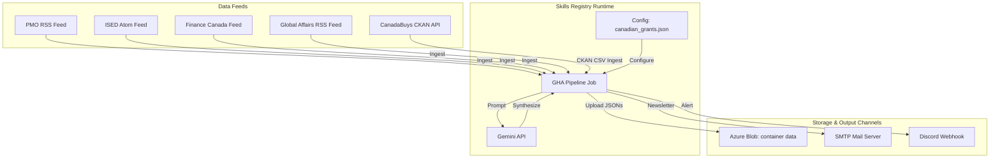

# Canadian Grants Intelligence Pipeline — arc42 Architecture Documentation

This document describes the software architecture of the Canadian Grants Intelligence pipeline, registered as a modular Skill running on the config-driven Generic Engine (mayAi).

---

## 1. Introduction and Goals

### 1.1 Requirements Overview
The Canadian Grants Intelligence Pipeline is a scheduled B2B monitoring system that tracks and synthesizes federal grants, funding allocations, and procurement tenders. It monitors:
1. **Prime Minister's Office (PMO)** announcements.
2. **Innovation, Science and Economic Development Canada (ISED)** updates.
3. **Finance Canada** releases.
4. **Global Affairs Canada** press releases.
5. **CanadaBuys (Canada's federal procurement portal)** active tenders.

Key features:
- **Modular Skill Decoupling**: Configured entirely via `configs/canadian_grants.json` and `configs/grants_anchors.json`.
- **Stateless CKAN Ingestion**: Interacts with the CanadaBuys CKAN API to ingest federal tenders, applying high-value keyword filters.
- **Tender Consolidation**: Merges, deduplicates, and prunes active tenders (updating states, downgrading "New" to "Open").
- **Case-Insensitive Run Modes**: Supports `deep_dive`, `pulse`, and `seed_strategy` execution scopes via argparse.
- **Dynamic Subscriber Distribution**: Downloads dynamic lists from a container-specific `subscribers.json` to send newsletters.
- **HTML Image Parity**: Custom newsletter compilers translate markdown images `` to clean inline `` tags.

---

## 2. Architecture Constraints

- **Execution Context**: ephermeral cron-based runs via GitHub Actions templates.
- **State Store**: Azure Blob Storage JSON files partitioned under the `data` container.
- **Historical Backups**: Respects prefix-less path structures (`reports/pmo_insights_{date}.json`) to preserve legacy dashboard loading compatibility.

---

## 3. System Context

---

## 4. Solution Strategy

The pipeline is registered as a Skill in the Generic Engine. Key strategies include:
- **Stateless CKAN Processing**: Queries the federal database and filters rows using keywords, sharing the endpoint with other Skills (like AMR Simulation) but isolated by config.
- **Tender Life Cycle Merging**: Existing active tenders are downloaded from Azure, matched with fresh CSV rows, and expired/closed entries are pruned.
- **Prefix-Less backups**: Configured with `prefix_historical_files: false` so that the daily backups are stored matching historical path conventions, preventing dashboard load failures.

---

## 5. Building Block View

- **configs/canadian_grants.json**: The Skill declaration. Holds sources, keywords, and storage filenames.
- **configs/grants_anchors.json**: Holds static reference facts for grounding B2B insights.
- **generic_engine/main.py**: The central platform executing the Skill.
- **generic_engine/api/notifier.py**: Translates Markdown digests containing images to Brand HTML emails and dispatches.

---

## 6. Runtime View

1. **Load Config**: The Generic Engine parses `canadian_grants.json` and logs versions.
2. **Azure Sync**: Downloads `processed_urls.json`, `pmo_insights.json`, `grants_anchors.json`, and container-level `subscribers.json`.
3. **Ingestion & Deduplication**: Fetches RSS feeds and CKAN CSV tables concurrently, filtering out tracked URLs.
4. **LLM Synthesis**: Sends uncached items to Gemini to generate LinkedIn Hooks and strategic co-bidding pivots.
5. **KPI generation**: Consolidates news metrics and active tender stats (`closing_this_week`, `new_today`).
6. **Newsletter Dispatch**: Converts markdown to HTML with inline image replacement and emails subscribers.

---

## 7. Deployment View

- **Workflows**: Configured to run on GHA via a clean wrapper trigger `daily_grants_scraper.yml` calling `run_pipeline.yml`.
- **Azure Blob**: Operations read and write directly to the `data` container.

---

## 8. Concepts

### 8.1 Per-Skill Subscriber Distribution
Instead of static distribution lists, the Grants Skill manages its list dynamically via a secure file `subscribers.json` located within its storage container, protecting the audience's privacy and allowing per-topic newsletters.

---

## 9. Design Decisions

- **Tender First-Class Support**: The Generic Engine treats tenders natively when `tenders_file` is defined, ensuring regional KPIs match legacy grants requirements.
- **Unified Run Modes**: Supported lowercase case-insensitive modes (`deep_dive`, `pulse`, `seed_strategy`) to allow full backfills or light delta scrapes.

---

## 10. Skills Registry Governance

The Canadian Grants Intelligence pipeline is fully decoupled under the central Skills Registry pattern:
- **Skill Boundary**: The Skill boundary encompasses the configuration layer (`canadian_grants.json`, `grants_anchors.json`) defining the scraper sources, keyword pre-filters, and LLM system instruction components (persona, classification, grounding, translation, formatting). The Harness boundary governs validation, telemetry metrics collection, cloud synchronization, and dynamic email dispatch.
- **Per-Skill Subscribers**: Audience records reside in `subscribers.json` inside the `data` storage container, ensuring email distribution is strictly isolated per topic.

