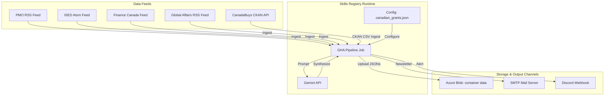
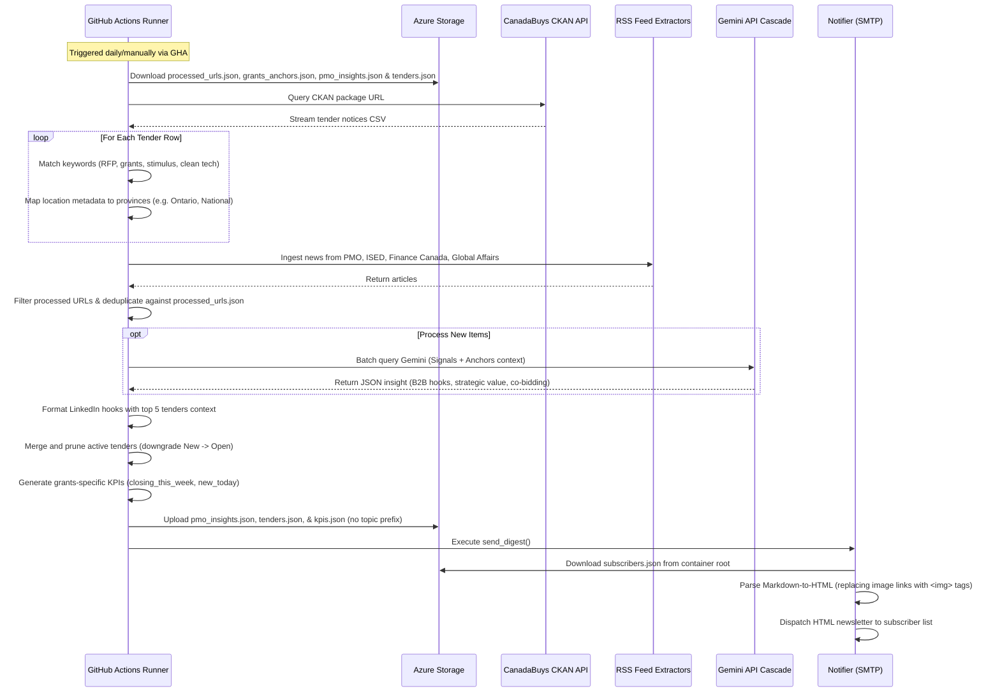

# Canadian Grants Intelligence Pipeline — arc42 Architecture Documentation

This document describes the software architecture of the Canadian Grants Intelligence pipeline, registered as a modular Skill running on the config-driven Generic Engine (mayAi).

---

## 1. Introduction and Goals

### 1.1 Requirements Overview
The Canadian Grants Intelligence Pipeline (Skill `canadian-grants`, displayed as `Canadian Grant Intelligence`) is a scheduled B2B monitoring system that tracks and synthesizes federal grants, funding allocations, and procurement tenders. It monitors:
1. **Prime Minister's Office (PMO)** announcements.
2. **Innovation, Science and Economic Development Canada (ISED)** updates.
3. **Finance Canada** releases.
4. **Global Affairs Canada** press releases.
5. **CanadaBuys (Canada's federal procurement portal)** active tenders.

Key features:
- **Modular Skill Decoupling**: Configured entirely via `configs/canadian_grants.json` and `configs/grants_anchors.json`.
- **Stateless CKAN Ingestion**: Interacts with the CanadaBuys CKAN API to ingest federal tenders, applying high-value keyword filters.
- **Tender Consolidation**: Merges, deduplicates, and prunes active tenders (updating states, downgrading "New" to "Open").
- **Case-Insensitive Run Modes**: Supports `deep_dive`, `pulse`, and `seed_strategy` execution scopes via argparse.
- **Dynamic Subscriber Distribution**: Downloads dynamic lists from a container-specific `subscribers.json` to send newsletters.
- **HTML Image Parity**: Custom newsletter compilers translate markdown images `` to clean inline `` tags.

### 1.2 Quality Goals
1. **Auditable Reference Traceability**: Every grants insight grounded in a slow-moving anchor must display a verified reference tracing back to the official strategy report or government release.
2. **Metadata Integrity**: Preserves and carries forward tender-specific attributes (e.g. closing dates, delivery provinces, categories, and partnering options) from the source database.
3. **Resilience**: The system falls back to generating notice URLs from the reference number if the `noticeURL-URLavis-eng` field is missing, ensuring tenders are not skipped.
4. **Historical Backups Compatibility**: Maintains prefix-less backup structures (`reports/pmo_insights_{date}.json`) to preserve legacy dashboard loading compatibility.

### 1.3 Stakeholders & Personas
- **B2B Co-bidder**: Requires access to synthesized post copy and strategic recommendations to form bidding consortiums.
- **Business Advisor / Subscriber**: Expects a clean, daily, morning email containing actionable grants and RFPs.
- **System Administrator**: Monitors scraping health, Cloud Scheduler triggers, and GHA execution status.

---

## 2. Architecture Constraints

- **Execution Context**: Ephemeral cron-based runs via GitHub Actions templates.
- **State Store**: Azure Blob Storage JSON files partitioned under the `data` container.
- **Historical Backups**: Respects prefix-less path structures (`reports/pmo_insights_{date}.json`) to preserve legacy dashboard loading compatibility.
- **Static Presentation Layout**: The client dashboard loads dynamically via client-side JavaScript, pulling assets directly from Azure Storage.

---

## 3. System Context



---

## 4. Solution Strategy

The pipeline is registered as a Skill in the Generic Engine. Key strategies include:
- **Stateless CKAN Processing**: Queries the federal database and filters rows using keywords, sharing the endpoint with other Skills (like AMR Simulation) but isolated by config.
- **Tender Life Cycle Merging**: Existing active tenders are downloaded from Azure, matched with fresh CSV rows, and expired/closed entries are pruned.
- **Prefix-Less Backups**: Configured with `prefix_historical_files: false` so that the daily backups are stored matching historical path conventions, preventing dashboard load failures.

---

## 5. Building Block View

```
generic_engine/
├── main.py                     # Main orchestrator (fetches feeds, groups by hub, calls Gemini)
├── models.py                   # Dataclass schemas for Insights and KPIs
├── schema.py                   # Pydantic V2 configuration validator
├── extractors/
│   ├── ckan.py                 # Direct CanadaBuys CKAN API database crawler
│   ├── rss.py                  # Parses RSS/Atom news feeds
│   └── report_scraper.py       # Standby PDF report crawler
└── api/
    ├── azure_client.py         # Azure Blob Storage client
    ├── gemini_client.py        # Gemini API interface
    └── notifier.py             # Email digest SMTP transmitter & failure notifier

configs/
├── canadian_grants.json        # Ingestion sources, search terms, and model parameters
└── grants_anchors.json         # Local seed database for slow-moving anchors (currently empty)

docs/
├── index.html                  # Frontend presentation dashboard
└── architecture_arc42_grants.md # This architecture document
```

---

## 6. Runtime View

### 6.1 Daily Ingestion & Synthesizer Flow



---

## 7. Deployment View

- **GCP Cloud Scheduler Triggers**: Configured in Google Cloud Scheduler as HTTP POST jobs dispatching directly to the GitHub repository API to run the workflows. The native GHA cron schedule sections are kept commented out as a local fallback.
  - `daily-grants-scraper-morning-trigger` running daily at `10:00 AM New York time` (14:00 UTC).
  - `daily-grants-scraper-midday-trigger` running daily at `2:00 PM New York time` (18:00 UTC).
  - `daily-grants-scraper-eod-trigger` running daily at `6:00 PM New York time` (22:00 UTC).
- **GitHub Actions Runner**: Executed on Ubuntu runners via `daily_grants_scraper.yml` calling `run_pipeline.yml`.
- **Azure Integration**: Reads and writes to the root `data` storage container.
- **Dashboard Deployment**: Dynamic Javascript in [docs/index.html](file:///c:/dev/canadian-grant-intelligence/docs/index.html) pulls directly from Azure. The dashboard links to [style.css](file:///c:/dev/canadian-grant-intelligence/docs/style.css).

---

## 8. Concepts

### 8.1 Per-Skill Subscriber Distribution
Instead of static distribution lists, the Grants Skill manages its list dynamically via a secure file `subscribers.json` located within its storage container (`data`), protecting the audience's privacy and allowing per-topic newsletters.

### 8.2 Markdown-to-HTML Parsing & Inline Image Replacement
To avoid external dependencies and keep the engine lightweight, a custom line-by-line parser compiles markdown text into newsletter-friendly HTML:
- **Lists (`-` or `*`)** are caught, grouped, and wrapped inside native `<ul>` and `<li>` tags with matching inline margins and padding.
- **Headers (`#` to `####`)** are mapped to `<h1-h4>` tags styled in brand gold (`#ffd700`).
- **Inline Bold (`**text**`)** is replaced with `<strong>` tags.
- **Hyperlinks (`[text](url)`)** are wrapped in anchor tags with text-decoration disabled and colored gold to ensure high visibility.
- **Inline Images (``)** are captured via regex and converted into clean, inline HTML `` tags styled for email clients.

### 8.3 State-Preserving Cache Merging (Tenders Lifecycle)
Unlike simple news signals, procurement opportunities have a distinct lifecycle:
- **Active Union**: The system downloads existing items from `tenders.json`, retains unexpired tenders, and merges them with fresh extraction records.
- **State Transition**: Closed or expired tenders are filtered out during the daily execution, keeping the active grants tracker accurate and clean.

### 8.4 Stateless CKAN Ingestion & Province Mapping
- Connects to the CanadaBuys CKAN API to ingest federal tender data.
- Streams the CSV package data, parses individual rows, and isolates relevant health-tech, clean-tech, and AI rows using keyword filters.
- Maps location fields to standard Canadian provinces using `LOCATION_TO_PROVINCE` mappings.

### 8.5 LinkedIn Post Tender Context
Formulates B2B LinkedIn posts containing summaries of the latest news and formatted bullet points of the top active tenders.

---

## 9. Design Decisions

- **Config-Driven Generalization**: Storing pipeline parameters (keywords, source lists, container settings) in JSON files allows adding new portals or pipelines without changing core orchestrator code.
- **Zero-Relational-Database JSON Storage**: Storing datasets as structured, static JSON files in Azure Blob allows the frontend to operate without a server-side backend, reducing hosting costs.
- **Low-RPM, High-TPM Optimization Strategy**: To safeguard Gemini API request quotas, new news items are batch-processed in groups of 5. This design aggregates texts into single API calls, taking advantage of Gemini's high token-per-minute (TPM) limit while staying well below the requests-per-minute (RPM) threshold.
- **Telemetry Observability**: The orchestrator automatically logs total API transaction sizes and token stats (`gemini_client.get_stats()`) at the end of each execution, providing complete visibility into usage costs and pipeline efficiency.
- **Prefix-Less backups**: Configured with `prefix_historical_files: false` so that the daily backups are stored matching historical path conventions, preventing dashboard load failures on the legacy dashboard.
- **Event Deck Exclusion**: Unlike the Clusters dashboard, the Grants dashboard does not render a collapsible Events & Milestones deck, as the Grants anchors database `grants_anchors.json` does not contain event scheduling records.


---

## 10. Skills Registry Governance

The Canadian Grants Intelligence pipeline is fully decoupled under the central Skills Registry pattern:
- **Skill Boundary**: The Skill boundary encompasses the configuration layer (`canadian_grants.json`, `grants_anchors.json`) defining the scraper sources, keyword pre-filters, and LLM system instruction components (persona, classification, grounding, translation, formatting). The Harness boundary governs validation, telemetry metrics collection, cloud synchronization, and dynamic email dispatch.
- **Per-Skill Subscribers**: Audience records reside in `subscribers.json` inside the `data` storage container, ensuring email distribution is strictly isolated per topic.
