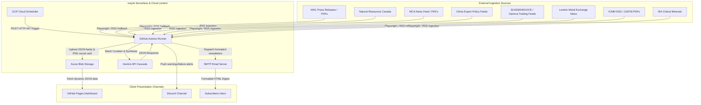
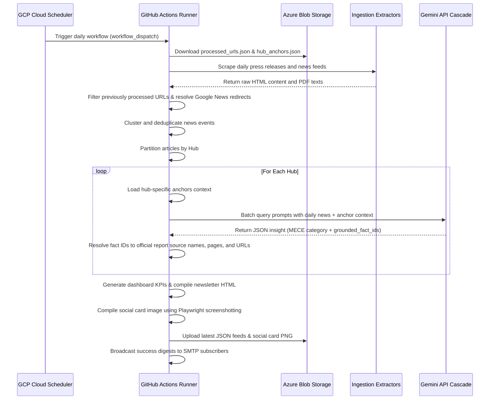
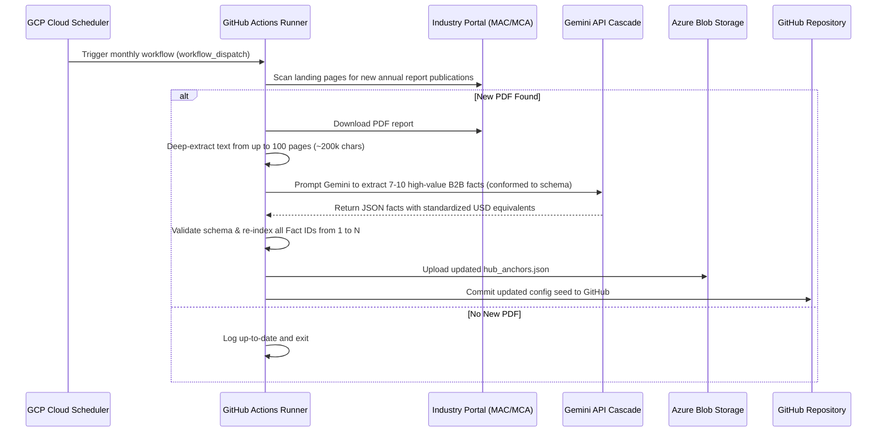

# Global Mining Hubs Intelligence Pipeline — arc42 Architecture Documentation

This document describes the software architecture of the Global Mining Hubs Intelligence Pipeline (mayAi).

---

## 1. Introduction and Goals

### 1.1 Requirements Overview
The Global Mining Hubs Intelligence Pipeline is a serverless, scheduled, config-driven monitoring and synthesis system. It tracks B2B opportunities, policy shifts, joint ventures, and mineral exploration updates across five key global mining hubs: **Canada, Australia, China, Switzerland, and the United Kingdom/Global**.

Key features:
- Ingests articles and tenders from peak industry body portals and critical mineral databases.
- Implements a **dual-speed cross-synthesis engine**: integrates slow-moving, long-term industry baselines (Anchors) with fast-moving daily news signals (Signals).
- Classifies procurement opportunities into exactly four Mutually Exclusive, Collectively Exhaustive (MECE) METS loop categories (Ops, ESG, Digital, PMO).
- Programmatically maps grounded fact IDs to prevent LLM page-number and source-URL hallucinations.
- Automatically compiles digest metrics, generates social card graphics, and broadcasts SMTP digests.

### 1.2 Quality Goals
1. **Auditable Reference Traceability**: Every B2B hook grounded in a slow-moving anchor must display a verified page number and source report URL, tracing back to the verified source of truth.
2. **Data Isolation & Context Safety**: News items are partitioned by hub prior to analysis to prevent mixed-context leakage during LLM synthesis.
3. **Execution Robustness**: Graceful waterfall cascading routes LLM requests through multiple fallback models if a primary model hits quota limits.
4. **Resilient Anchors DB**: The orchestrator falls back to a local configurations seed file if Azure Blob Storage is unreachable.

### 1.3 Stakeholders & Personas
- **Business Analyst / subscriber**: Requires access to synthesized hooks, METS loops classifications, and original sources to identify bidding partnerships.
- **System Administrator**: Needs alerts for scraping/Playwright failures, rate-limit warnings, and API quota status.
- **Knowledge Manager**: Manages the monthly ingestion and validation of the annual industry reports.

---

## 2. Architecture Constraints

- **Storage Constraint**: Zero relational database footprint; all state registries (processed URLs, KPIs, curated anchors, insights list) are stored as raw JSON files in Azure Blob Storage.
- **Trigger Serverless Execution**: Orchestration runs entirely serverless, triggered externally by Google Cloud Scheduler dispatching dispatches requests to GitHub Actions.
- **Static Presentation Layout**: The client dashboard must load dynamically via client-side JavaScript, pulling assets directly from Azure Storage.

---

## 3. System Context



---

## 4. Solution Strategy

The pipeline implements three core design strategies to handle the integration of slow and fast data speeds:

1. **Dual-Speed Cross-Synthesis**: Slow-moving annual anchor facts are indexed with unique integer Fact IDs. When daily signals are scraped, they are grouped by hub, and the matching hub anchor facts are appended to the Gemini prompt context.
2. **Programmatic Reference Resolution**: Instead of allowing the LLM to write page numbers and source URLs (which leads to hallucinations), the model only returns the list of selected integer `grounded_fact_ids`. The Python script programmatically resolves the report name, page range, and URL from the local anchor database.
3. **Double-Extraction Playwright Scraper**: Playwright scrapes landing pages. If it detects thin text or nested download links, it downloads the PDF and extracts text in memory (up to 100 pages for Level 3 documents), preserving formatting.
4. **Model waterfall Fallbacks**: Requests use a tiered model waterfall (`gemini-3.5-flash` $\rightarrow$ `gemini-2.5-flash` $\rightarrow$ `gemini-3.1-flash-lite` $\rightarrow$ `gemini-2.5-flash-lite`) to bypass saturated API quotas and rate limits.

---

## 5. Building Block View

```
generic_engine/
├── main.py                     # Main orchestrator (fetches feeds, resolves references, compiles data)
├── models.py                   # Dataclass schemas for Tenders, Tenders Insights, and KPIs
├── schema.py                   # Pydantic V2 configuration validator
├── api/
│   ├── azure_client.py         # Azure Blob Storage API wrapper
│   ├── gemini_client.py        # Gemini client featuring cascade fallback & deduplication
│   └── notifier.py             # Alert notifier for SMTP and Discord
└── extractors/
    ├── rss.py                  # Ingests and parses RSS news feeds
    ├── playwright_scraper.py   # Scrapes JS-rendered pages using Playwright browser contexts
    └── report_scraper.py       # Resolves Google News redirects and handles PDF text extraction

scripts/
└── update_anchors.py           # Automated discovery and deep PDF curation engine for anchors

configs/
├── mining_hubs.json            # Pipeline sources, display settings, and model settings
└── hub_anchors.json            # Local seed config database for the slow-moving anchors
```

---

## 6. Runtime View

### 6.1 Daily Ingestion & Synthesizer Flow (Signals + Anchors)



### 6.2 Monthly Curation Flow (Slow-Mover Updates)



---

## 7. Deployment View

- **Triggers**: Configured in Google Cloud Scheduler as HTTP POST jobs dispatching directly to the GitHub repository API:
  - `daily-mining-hubs-scraper-trigger` running daily at `16:00 UTC`.
  - `monthly-mining-hub-anchors-update-trigger` running monthly on the 1st at `00:00 UTC`.
- **Compute Runner**: Executed in GitHub Actions Virtual Environments (`ubuntu-latest`).
- **Static Frontend**: Hosted on GitHub Pages, loading client-side data dynamically via JSON calls to the public Azure Blob container URL.

---

## 8. Concepts

### 8.1 MECE METS Loop Classifications
To ensure B2B opportunities are structured logically, the system classifies every insight into exactly one of four MECE categories based on the **primary B2B supply contract type**:
* **METS-Ops (Operations & Equipment)**: Heavy machinery, fleet electrification, physical processing plants, drilling, logistics.
* **METS-ESG (Sustainability & Environmental)**: Tailings management (GISTM), water stewardship, carbon capture, land reclamation.
* **METS-Digital (Software, Analytics & Remote Sensing)**: AI-driven permitting, 5G remote operations, geological modeling software, **Data Centers** (edge compute, green data storage), and **Space Tech** (satellite remote sensing/InSAR, telemetry, Starlink site connectivity).
* **METS-PMO (Advisory, Permitting & Engineering)**: Pre-feasibility engineering, legal permitting advisory, JV/offtake transaction support.

### 8.2 Hallucination-Proof Grounding
The LLM prompt is injected with uniquely tagged anchor statements:
`[Fact ID: 8] Regulatory delays mean it takes 12-15 years to build a new mine in Canada.`
By instructing the model to return *only* the matching integer IDs (`"grounded_fact_ids": [8]`), we prevent the model from fabricating page numbers or download links, guaranteeing that the dashboard references are completely auditable.

---

## 9. Design Decisions

- **Waterfall Model Cascade**: Routes API payloads through a tiered cascade of models, dynamically pivoting if a primary model is throttled, ensuring high runtime availability.
- **Offline Redirection Decoder**: Uses an offline Google News redirect URL decoder to resolve links prior to processing, maintaining clean caching keys and avoiding HTTP redirection delays for dashboard users.
- **No-Relational-Database JSON Storage**: Storing datasets as structured, static JSON files in Azure Blob allows the frontend to operate without a server-side backend, reducing hosting costs.
- **Exclusion of Gemstone & Luxury Hubs**: Gemstone trading and extraction hubs (e.g., Antwerp, Botswana, or South American gemstone mines) are excluded from the pipeline due to supply chain divergence (luxury consumer goods vs. industrial green-tech), data feed fragmentation (predominantly artisanal and un-structured ASM mining), and lack of alignment with B2B industrial grant and consortium frameworks.
- **Per-source query-refactoring bypass**: Introduced `skip_query_refactoring` to allow specific RSS searches to bypass the generic B2B keyword `AND` appending logic. This allows thin or policy-specific sources (like NRCan and China Export Controls) to ingest highly targeted feeds without being filtered to zero by the 30-day lookback logic.
- **Multi-language ingestion support**: Added French-language RSS ingestion for Geneva commodity trading (e.g. Glencore/Trafigura) with a translation instruction in the LLM system prompt. This expands geographical and business intelligence without polluting English-only search results.
