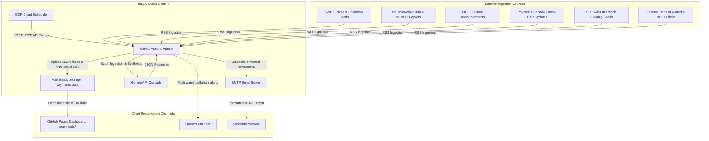
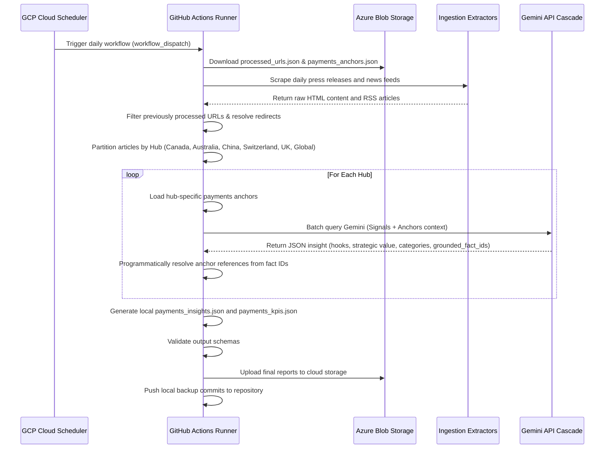

# Global Payments & Settlement Intelligence Pipeline — arc42 Architecture Documentation

This document describes the software architecture of the Global Payments & Settlement Intelligence Pipeline (mayAi).

---

## 1. Introduction and Goals

### 1.1 Requirements Overview
The Global Payments & Settlement Intelligence Pipeline is a serverless, scheduled, config-driven monitoring and synthesis system. It tracks international transaction clearing, currency swap lines, ISO 20022 migration milestones, wholesale ledger innovation (e.g., Project mBridge), and corporate trade finance across five key regional hubs: **Canada, Australia, China, Switzerland, and the United Kingdom/Global**.

Key features:
- Ingests cross-border payments and treasury articles from central banks, global standards bodies, and financial news networks.
- Implements a **dual-speed cross-synthesis engine**: integrates slow-moving, long-term payment infrastructure baselines (Anchors) with fast-moving daily news signals (Signals).
- Classifies transaction opportunities into exactly five Mutually Exclusive, Collectively Exhaustive (MECE) payments categories: **Standards**, **Sovereign Rails**, **Correspondent Networks**, **Trade Finance**, and **Liquidity Valves**.
- Programmatically maps grounded fact IDs from the local payments anchors database to prevent LLM hallucinations.
- Automatically compiles digest metrics, generates social card graphics, and broadcasts SMTP digests.

### 1.2 Quality Goals
1. **Auditable Reference Traceability**: Every payments insight grounded in a slow-moving anchor must display a verified reference tracing back to the official standards report or central bank release.
2. **Data Isolation**: News items are partitioned by regional hub prior to analysis to prevent mixed-context leakage during LLM synthesis.
3. **Execution Robustness**: Waterfall cascading routes LLM requests through multiple fallback models if a primary model hits quota limits.
4. **Resilient Anchors DB**: The orchestrator falls back to a local configurations seed file (`payments_anchors.json`) if Azure Blob Storage is unreachable.

### 1.3 Stakeholders & Personas
- **B2B Corporate Treasurer / Bid Manager**: Evaluates the daily *Executive Digest* to identify currency clearing optimizations, trade finance opportunities, and cross-border settlement risks.
- **System Administrator**: Monitors scraping health, Cloud Scheduler triggers, and GHA execution status.
- **Knowledge Manager**: Manages the monthly ingestion and validation of standard payment guidelines (e.g., SWIFT and BIS roadmap updates).

---

## 2. Architecture Constraints

- **Storage Constraint**: Zero relational database footprint; all state registries (processed URLs, KPIs, curated anchors, insights list) are stored as raw JSON files in Azure Blob Storage under the `payments-data` container.
- **Serverless Trigger**: Execution runs entirely serverless, triggered externally by Google Cloud Scheduler dispatching HTTP POST requests to the GitHub Actions workflow.
- **Static Presentation Layout**: The client dashboard loads dynamically via client-side JavaScript, pulling assets directly from Azure Storage.

---

## 3. System Context



---

## 4. Solution Strategy

The pipeline implements three core design strategies to handle the integration of slow and fast data speeds:

1. **Dual-Speed Cross-Synthesis**: Slow-moving payment anchors are indexed with unique integer Fact IDs in `configs/payments_anchors.json`. When daily signals are scraped, they are grouped by hub, and the matching hub anchors are appended to the Gemini prompt context.
2. **Programmatic Reference Resolution**: The model returns the list of selected integer `grounded_fact_ids`, and the Python script programmatically resolves the source name, page range, and URL from the local anchors database.
3. **MECE Payments Taxonomy**: Gemini classifies insights into the five payments categories, which the frontend JS parses to map onto standard CSS styles:
   - `pmt-standards` (ISO 20022, SWIFT rules)
   - `pmt-sovereign` (mBridge, wholesale CBDCs)
   - `pmt-correspondent` (De-risking, intermediary banking)
   - `pmt-trade` (Letters of Credit, Supply Chain Finance)
   - `pmt-liquidity` (Central bank swap lines)

---

## 5. Building Block View

```
generic_engine/
├── main.py                     # Main orchestrator (fetches feeds, groups by hub, calls Gemini)
├── models.py                   # Dataclass schemas for Insights and KPIs
└── schema.py                   # Pydantic V2 configuration validator

configs/
├── global_payments.json        # Ingestion sources, search terms, and model parameters
└── payments_anchors.json       # Local seed database for slow-moving payment anchors

docs/
├── payments/
│   └── index.html              # Frontend presentation dashboard
└── architecture_arc42_payments.md # This architecture document
```

---

## 6. Runtime View

### 6.1 Daily Ingestion & Synthesizer Flow



---

## 7. Deployment View

- **GitHub Actions Runner**: Executed daily on Ubuntu runners via `daily_payments_scraper.yml` calling `run_pipeline.yml`.
- **Azure Integration**: Reads and writes to the `payments-data` storage container.
- **Dashboard Deployment**: Dynamic Javascript in [docs/payments/index.html](file:///c:/dev/canadian-grant-intelligence/docs/payments/index.html) pulls directly from Azure. The dashboard links to [style.css](file:///c:/dev/canadian-grant-intelligence/docs/style.css).

---

## 8. Concepts

### 8.1 Markdown-to-HTML Parsing
To avoid external dependencies and keep the engine lightweight, a custom line-by-line parser compiles markdown text into newsletter-friendly HTML:
- **Lists (`-` or `*`)** are caught, grouped, and wrapped inside native `<ul>` and `<li>` tags with matching inline margins and padding.
- **Headers (`#` to `####`)** are mapped to `<h1-h4>` tags styled in brand gold (`#ffd700`).
- **Inline Bold (`**text**`)** is replaced with `<strong>` tags.
- **Hyperlinks (`[text](url)`)** are wrapped in anchor tags with text-decoration disabled and colored gold to ensure high visibility.

### 8.2 Brand Link Injections & Regex Constraints
During the post-synthesis phase, a regex mapper runs lookarounds to detect text mentions of payment networks and central banks, hyper-linking them to their official domains:
- **SWIFT** -> `https://www.swift.com/`
- **BIS** -> `https://www.bis.org/`
- **mBridge** -> `https://www.bis.org/about/bisih/topics/cbdc/mcbdc.htm`
- **Federal Reserve** -> `https://www.federalreserve.gov/`
- **CIPS** -> `https://www.cips.com.cn/en/`

#### Technical Constraints:
* **Lookup Safeguards (Lookarounds)**: The regex engine applies negative lookarounds `(?<!\[){re.escape(name)}(?!\])` to match only plain text mentions, preventing double-hyperlinking of terms that are already part of markdown links.
* **Ordering Dependency**: The replacement dictionary is ordered strictly from longest name to shortest name. This sequence avoids partial-match corruption, where matching the shorter prefix first would break the longer entity's layout.

### 8.3 Ingestion Cache Management
The system avoids infinite cache bloat without needing automated database pruning routines:
- **Lookback-Based Filtering**: Standard ingestions filter out and discard entries older than the `SCRAPE_LOOKBACK_DAYS` (default: 30 days) lookback window.
- **Active Union Write-Back**: The output file `payments_insights.json` represents a clean union of active scraper feed items and fail-safe retained items. When old news releases drop off the portals or the 30-day feed window, they are naturally omitted during write-back, keeping the file small and optimizing frontend performance.

### 8.4 Multi-Language Ingestion & Translation
To expand global reach, the payments pipeline scrapes French, German, and Chinese financial feeds. The engine system prompt includes strict translation instructions to ensure that these articles are translated to English before synthesis, ensuring a unified English digest format for subscribers.

---

## 9. Design Decisions

- **Config-Driven Generalization**: Storing pipeline parameters (keywords, source lists, container settings) in JSON files allows adding new portals or pipelines without changing core orchestrator code.
- **Zero-Relational-Database JSON Storage**: Storing datasets as structured, static JSON files in Azure Blob allows the frontend to operate without a server-side backend, reducing hosting costs.
- **Low-RPM, High-TPM Optimization Strategy**: To safeguard Gemini API request quotas, new news items are batch-processed in groups of 5. This design aggregates texts into single API calls, taking advantage of Gemini's high token-per-minute (TPM) limit while staying well below the low requests-per-minute (RPM) threshold.
- **Telemetry Observability**: The orchestrator automatically logs total API transaction sizes and token stats (`gemini_client.get_stats()`) at the end of each execution, providing complete visibility into usage costs and pipeline efficiency.
- **Collapsible Events & Milestones Deck**: Implemented a dynamic, collapsible card deck directly above the daily signals list. It fetches conformed summits, webinars, and global conference facts from a static anchors database (`payments_anchors.json`) based on their type, and handles empty states by hiding the component if no active events exist for a hub, ensuring clean visual presentation.
- **Bypass Refactoring for Payments Feeds**: Configured targeted RSS feeds to bypass the engine's query refactoring logic using `skip_query_refactoring: true`. This prevents the engine from appending broad B2B search terms that would otherwise restrict the high-fidelity feed outputs to zero, since the search queries are already highly specific.

---

## 10. Skills Registry Governance

The Global Payments & Settlement Intelligence pipeline is fully decoupled under the central Skills Registry pattern:
- **Skill Boundary**: The Skill boundary encompasses the configuration layer (`global_payments.json`, `payments_anchors.json`) defining the scraper sources, keyword pre-filters, and LLM system instruction components (persona, classification, grounding, translation, formatting). The Harness boundary governs validation, telemetry metrics collection, cloud synchronization, and dynamic email dispatch.
- **Per-Skill Subscribers**: Audience records reside in `subscribers.json` inside the `payments-data` storage container, ensuring email distribution is strictly isolated per topic.

