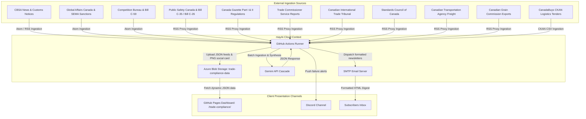
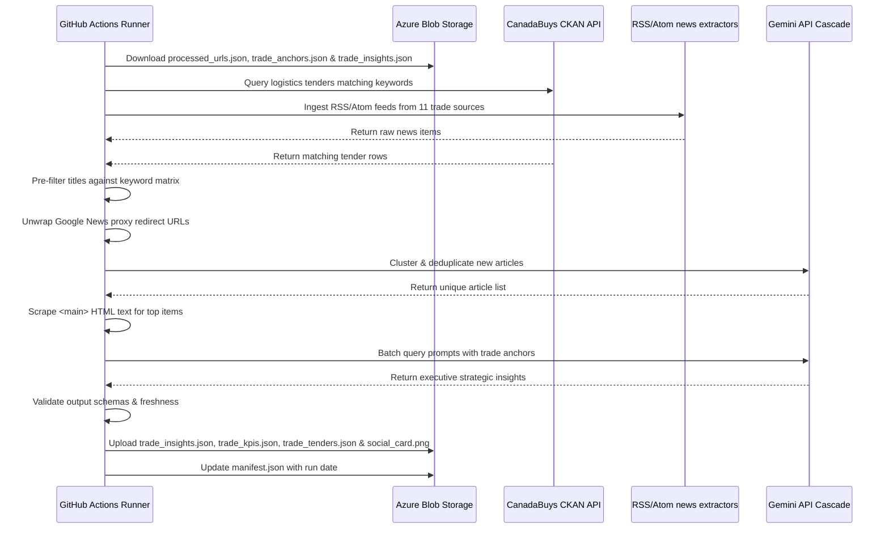

# Canadian Trade & Supply Chain Compliance Pipeline — arc42 Architecture Documentation

This document describes the software architecture of the Canadian Trade & Supply Chain Compliance Intelligence Pipeline (`trade_compliance.json`).

---

## 1. Introduction and Goals

### 1.1 Requirements Overview
The Canadian Trade & Supply Chain Compliance Intelligence Pipeline is a serverless, scheduled, config-driven monitoring and synthesis system. It tracks border enforcement notices, customs tariff updates, forced labour import prohibitions (Bill C-35), trade tribunal decisions (CITT), competition rules (Bill C-59), critical infrastructure cybersecurity mandates (Bill C-26), Special Economic Measures Act (SEMA) sanctions, and logistics procurement across Canada.

Key features:
- **Multi-Layered Ingestion (12 Sources)**: Scrapes official Atom/RSS feeds and Google News search proxies across 5 operational trade layers (Trade Policy, Customs/Border, Standards & Metrology, Modal Freight Regulators, and Trade Remedies).
- **Direct Database Integration (CKAN API)**: Crawls the live CanadaBuys dataset API for logistics, warehousing, freight, and supply chain tenders.
- **Geopolitical Sanctions & Transshipment Evasion Screening**: Monitors SEMA sanctions, Autonomous Sanctions Regulations, and transshipment evasion risks involving high-risk jurisdictions and raw material origin tracking.
- **Publication-Grade Executive Narrative (Zero Meta-Labels)**: Enforces clean, authoritative executive narrative prose, completely eliminating artificial header tags such as `"SO WHAT?"`, `"WEAKENS"`, or `"BUILDS"`.
- **4-Part Value Framework**: Synthesizes every insight across direct bottom-line financial penalties ($/day demurrage, capital tie-ups), physical logistics execution plays (PO Chain-of-Custody mandates, LC drawdown conditions, neutral transit warehouse buffers), competitive winner/loser market dynamics, and concrete B2B consulting pitches.
- **Disambiguated Keyword Matrix**: Enforces exact word boundaries (`\b`) and explicit plural forms for short acronyms (`CARMs`, `CITTs`, `CBSAs`, `CRAs`, `SCCs`, `CTAs`, `CGCs`, `EIPAs`, `FIPAs`, `CUSMAs`, `RFIs`, `RFPs`, `SMEs`, `TDGs`).

### 1.2 Quality Goals
1. **Clean Executive Tone**: Outputs are generated in publication-grade prose suitable for C-suite supply chain directors and business developers without robotic prompt artifacts.
2. **Auditable Reference Traceability**: Insights grounded in slow-moving trade anchors display verified reference links tracing back to official legislation or regulatory notices.
3. **Metadata Integrity**: Preserves and carries forward tender-specific attributes (closing dates, purchasing entities, playbooks) from the CanadaBuys database.
4. **Azure Resource Protection**: Container `trade-compliance-data` operates inside the existing Azure Storage Account using existing Key Vault credentials (`MyAgentKeyVault`).

### 1.3 Stakeholders & Personas
- **Chief Supply Chain Officer / VP Logistics**: Uses the dashboard to quantify demurrage exposure, update international PO clauses, manage CARM bonding requirements, and audit Scope 3 freight telematics under Bill C-59.
- **B2B Business Developer / Trade Consultant**: Uses the synthesized *Consulting Pivots* to pitch productized advisory packages ($1,500/vessel Pre-Arrival Clearance Bundles, $15k CARM Integration, $25k Telematics Carbon Audits) to enterprise clients.

---

## 2. Architecture Constraints

- **Storage Constraint**: Zero relational database footprint; all state registries (processed URLs, KPIs, curated anchors, insights, tenders) are stored as raw JSON files in Azure Blob Storage under the `trade-compliance-data` container.
- **Serverless Trigger**: Execution runs serverless, scheduled via GitHub Actions workflow (`daily_trade_compliance_scraper.yml`) using the shared `run_pipeline.yml` runner job.
- **Client-Side Rendering**: Static frontend hosted on GitHub Pages (`/trade-compliance/`) pulling raw JSON outputs asynchronously from Azure Storage.

---

## 3. System Context



---

## 4. Solution Strategy

The pipeline implements four core architectural strategies:

1. **Dual-Speed Cross-Synthesis**: Slow-moving compliance anchors in `configs/trade_anchors.json` are indexed with integer `id` keys. When daily news signals are scraped, matching hub anchors are appended to the LLM prompt context for grounded synthesis.
2. **Programmatic Reference Resolution**: The LLM returns selected `grounded_fact_ids`, which Python programmatically resolves to official source names and URLs without hallucination.
3. **Disambiguated Keyword Filter**: Short acronyms are bounded (`\b`) and paired with high-value anchors (`customs`, `tariff`, `demurrage`, `CARM`, `forced labour`, `SEMA`, `sanctions`) to discard unrelated news items before LLM analysis.
4. **Clean Narrative System Instruction**: The LLM system instruction strictly prohibits artificial meta-labels (`"SO WHAT?"`, `"WEAKENS"`, `"BUILDS"`), generating fluid publication-grade executive prose across 3 structured bullets (Financial & Competitive Impact, Physical Logistics Playbook, and `* **Consulting Pivot:** `).

---

## 5. Building Block View

```
generic_engine/
├── main.py                     # Main orchestrator (fetches feeds, resolves anchors, calls Gemini, updates manifests)
├── models.py                   # Dataclass schemas for Insights and KPIs
├── schema.py                   # Pydantic V2 configuration validator
├── extractors/
│   ├── ckan.py                 # Direct CanadaBuys CKAN API database crawler
│   ├── rss.py                  # Parses RSS/Atom news feeds
│   └── report_scraper.py       # HTML semantic container report scraper
└── api/
    ├── azure_client.py         # Azure Blob Storage client wrapper
    ├── gemini_client.py        # Gemini API interface with waterfall fallbacks
    └── notifier.py             # Email digest SMTP transmitter & Discord alert client

configs/
├── trade_compliance.json       # Ingestion sources, search terms, and model parameters
└── trade_anchors.json          # Local seed database for slow-moving trade anchors

docs/
├── trade-compliance/
│   └── index.html              # Frontend presentation dashboard
└── architecture_arc42_trade_compliance.md # This architecture document

scripts/
└── run_trade_compliance.py     # Local execution wrapper script

.github/workflows/
└── daily_trade_compliance_scraper.yml # GitHub Actions workflow definition
```

### 5.2 Configured Ingestion Sources and LLM Model
The pipeline is configured via `configs/trade_compliance.json`:
- **Primary LLM Model:** `gemini-3.5-flash` (Fallback chain: `gemini-2.5-flash` $\rightarrow$ `gemini-3.1-flash-lite` $\rightarrow$ `gemini-2.5-flash-lite`)
- **Ingestion Sources:**
  - `CBSA_News` (GC News API Atom)
  - `GAC_News` (GC News API Atom)
  - `CompetitionBureau_News` (GC News API Atom)
  - `PublicSafety_ForcedLabour_News` (Google News RSS proxy)
  - `CBSA_Customs_Notices` (Google News RSS proxy)
  - `CanadaGazette_Regulations` (Google News RSS proxy)
  - `TCS_Market_Intelligence` (Google News RSS proxy)
  - `CITT_Decisions` (Google News RSS proxy)
  - `SCC_Standards_News` (Google News RSS proxy)
  - `CTA_Freight_News` (Google News RSS proxy)
  - `CGC_Grain_Export_News` (Google News RSS proxy)
  - `CanadaBuys_Logistics_Tenders` (CanadaBuys CKAN API)

---

## 6. Runtime View

### 6.1 Daily Ingestion & Synthesizer Flow



---

## 7. Deployment View

- **Pipeline Execution**: Runs via GitHub Actions workflow (`daily_trade_compliance_scraper.yml`) using the shared runner job `.github/workflows/run_pipeline.yml`.
- **Azure Blob Storage**: Data is stored under container `trade-compliance-data` in the existing Azure Storage Account.
- **Frontend Presentation**: Hosted on GitHub Pages at `/trade-compliance/`, fetching dynamic JSON feeds asynchronously.

---

## 8. Concepts

### 8.1 Automated Data Verification
The pipeline executes dynamic output verification checks prior to cloud upload:
- **Schema Completeness**: Validates presence of `trade_insights.json`, `trade_kpis.json`, `trade_anchors.json`, and `manifest.json`.
- **Clean Executive Tone Check**: Ensures `strategic_value` bullets follow clean narrative formatting without prohibited meta-labels.

---

## 9. Design Decisions

- **Dedicated Pipeline Container (`trade-compliance-data`)**: Isolating trade compliance data into its own container prevents cache pollution across domain hubs.
- **Disambiguated Acronym Keyword Boundaries**: Using exact word boundaries (`\b`) and explicit plural keywords prevents false-positive matches (e.g. preventing `CRA` from matching `crash`).
- **Clean Executive Narrative Prompting**: Removing artificial header tags (`SO WHAT?`, `WEAKENS`, `BUILDS`) ensures outputs read as publication-grade executive briefs.
