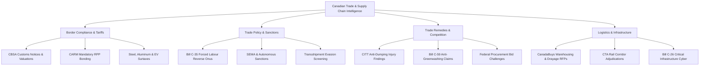

# Canadian Trade & Supply Chain Compliance Intelligence — LinkedIn Stand-Up Launch Package

> [!NOTE]
> The underlying intelligence engine (`trade_compliance.json`), live data scraping workflow, and public web dashboard are **100% operational in production**. This package provides everything required to launch the corresponding LinkedIn Newsletter / Page presence immediately.

---

## 1. Executive Summary & Engine Status

| Component | Status | Location / Reference |
| :--- | :--- | :--- |
| **Scraper & Synthesis Engine** | 🟢 Live | `configs/trade_compliance.json` |
| **Scraper Automation** | 🟢 Live | `.github/workflows/daily_trade_compliance_scraper.yml` |
| **Live Intelligence Feed** | 🟢 Active | `docs/data/trade-compliance/trade_insights.json` |
| **Public Interactive Dashboard** | 🟢 Deployed | [Trade & Supply Chain Dashboard](https://4mayAi.github.io/canadian-grant-intelligence/trade-compliance/) |
| **LinkedIn Brand Kit & Logo Options** | 🟢 3 Rich 'mayAi' Concepts | Embedded below (`trade_logo_mayai_v4.jpg`, `v5`, `v6`) |
| **Inaugural Article Draft** | 🟢 Ready | Grounded in live July 2026 dataset |

---

## 2. Brand Identity & Visual Asset Options (mayAi Golden Egg & Trade Supply Chain Context)

To maintain consistent corporate identity across all platform channels, every logo option combines the signature **glowing golden egg** with explicit **mayAi** brand typography (`may` in crisp white/silver, `Ai` in vibrant metallic gold) and rich trade/supply chain visual context (cargo containers, intermodal rail lines, port terminal cranes).

Below are 3 rich, trade-contextualized logo concepts containing **ONLY** the `mayAi` wordmark (strictly zero other words):

````carousel

*Concept A: Golden Egg Seated at Cargo Container Port Terminal with Intermodal Rail & Crane Illumination*
<!-- slide -->

*Concept B: Golden Egg Floating in High-Tech Shipping Container Gateway with Trade Route Lines*
<!-- slide -->

*Concept C: Golden Egg Container Vault with Laser Border Gridlines & Dark Gold Sheen*
````

### Recommended Brand Option
**Concept A (Golden Egg Port Terminal & Cargo Stack)** is recommended as the primary avatar. It seamlessly embeds the glowing golden egg atop dark maritime shipping containers and port cranes while displaying **ONLY** the clean `mayAi` brand wordmark.

### Newsletter & Page Metadata

- **Newsletter Title:** `Canadian Trade & Supply Chain Compliance Intelligence`
- **Subtitle / Tagline:** `Sovereign Border Enforcement, CARM Bonding, Forced Labour & Logistics Risk`
- **Publishing Frequency:** `Bi-weekly (Thursdays)` or `Weekly (Fridays)`
- **Category:** `International Trade` / `Logistics & Supply Chain` / `Government Administration`

### Page / Newsletter "About" Description

```text
Canadian Trade & Supply Chain Compliance Intelligence synthesizes border enforcement notices (CBSA), trade policy updates (Global Affairs Canada), competition guidelines (Competition Bureau), forced labour provenance mandates, and federal logistics procurements (CanadaBuys) into publication-grade executive intelligence.

We cover customs tariff classifications, CARM financial security bonding, Special Economic Measures Act (SEMA) sanctions, transshipment evasion screening, ESG anti-greenwashing transit liabilities, and critical infrastructure cybersecurity. Designed for Chief Supply Chain Officers, VPs of Logistics, International Trade Counsel, Licensed Customs Brokers, and B2B Consultants seeking high-value trade risk mitigation and consortia opportunities.

Track active opportunities live: https://4mayAi.github.io/canadian-grant-intelligence/trade-compliance/
```

---

## 3. Content Pillars & Classification Framework

Every edition categorizes industry intelligence into four core operational tracks:



---

## 4. Inaugural LinkedIn Newsletter Post Draft

> **Edition Title:** *The $1M Demurrage Trap: Forced Labour Reverse Onus, CARM Bonding & ESG Transit Liabilities*  
> **Target Date:** July 2026  

---

### 📦 Live Federal Trade & Supply Chain Signals

#### 1. Forced Labour Reverse Onus Enforcement (Bill C-35 Framework)
Global Affairs Canada's transition to a statutory "reverse onus" high-risk goods framework directly targets third-country transshipment hubs used to evade Canadian sanctions and forced labour prohibitions. With CBSA targeted holds extending West Coast container dwell times up to 30 days at Vancouver and Prince Rupert, unverified shipments face a direct $350/day per TEU demurrage penalty—equal to over $1,050,000 per 100-container vessel.
- **Financial Bottom Line:** $750k–$1.35M direct demurrage penalty per shipment; tied-up working capital triggers downstream line-shutdown contract default.
- **Logistics Playbook:** Update international POs to require mandatory Tier-3 origin certificates before Letter of Credit (LC) drawdown. Hold high-risk components in bonded neutral transit hubs (Vietnam, Taiwan, Mexico) to pre-clear CBSA documentation 14 days prior to sailing.
- \* **Consulting Pivot ($1,500/Vessel Clearance Pitch):** Pitch Canadian importers a productized **'Pre-Arrival Provenance Clearance Bundle' ($1,500/vessel)** that audits Tier-N supply chains prior to vessel departure, ensuring guaranteed 48-hour CBSA release and protecting client margins.

#### 2. Mandatory CARM System Rules & Surtax Verifications (CN26-04)
CBSA has operationalized CARM as the official system of record, enforcing mandatory Release Prior to Payment (RPP) financial bonding. Importers lacking direct corporate surety bonds face immediate border refusals at inland intermodal terminals in Toronto and Montreal, incurring $500/day storage fees.
- **Financial Bottom Line:** Requires mid-market importers to post $50k–$250k in cash collateral or surety bonds; unbonded shipments face immediate border refusals.
- **Logistics Playbook:** Bypass generic broker bonds and secure direct corporate surety bond coverage. Integrate ERP billing systems (SAP/Oracle) directly with the CBSA CARM portal to ensure real-time duty reconciliation.
- \* **Consulting Pivot ($15,000 CARM Integration Pitch):** Pitch mid-sized manufacturers a **'CARM Financial Security & API Workflow Integration' ($15,000 flat fee)** that automates surety bonding setup, links ERP billing directly to CBSA, and eliminates manual customs reconciliation friction.

#### 3. Competition Act Anti-Greenwashing Guidelines (Bill C-59 Framework)
The Competition Bureau's finalized enforcement guidelines empower private parties to challenge environmental marketing before the Competition Tribunal, exposing shippers and freight carriers to penalties of up to 3% of global revenue for unverified "carbon-neutral transit" marketing.
- **Financial Bottom Line:** Severe exposure to private right-of-action lawsuits and penalties up to 3% of global turnover.
- **Logistics Playbook:** Transportation procurement teams must require all logistics providers (rail, ocean, motor carrier) to provide telematics-based Scope 1 and Scope 3 fuel consumption data under ISO 14064 standards.
- \* **Consulting Pivot ($25,000 Telematics Green Shield Pitch):** Pitch intermodal shippers and transport operators a **'Bill C-59 Telematics-Backed Carbon Audit' ($25,000)** that verifies Scope 3 freight emissions against ISO 14064 accounting standards, protecting them from greenwashing litigation while strengthening green RFP positioning.

#### 4. Active CanadaBuys Tender: DND National Supply Depots Warehousing & CARM Clearance
The Department of National Defence (DND) has issued an $18 Million Request for Proposals (RFP W8486-26-0149) for integrated warehousing, container drayage, and customs clearance services across major distribution depots (Edmonton, Montreal, Halifax).
- **Tender Scope:** $18M over 36 months for national depot sustainment.
- \* **Subcontract Integration Pivot:** Do not bid directly if lacking physical depot space. Approach shortlisted prime logistics contractors (e.g. Canada Cartage, Schenker) to provide the specialized **CARM API data bridge** and **ISO 14064 telematics reporting software** required under mandatory Technical Criteria M3 and M7, securing a 10–15% software subcontract slice ($1.8M–$2.7M value).

---

## 5. Subscription & Audience Growth Strategy

### Target Audience Personas

1. **Chief Supply Chain Officers & VPs of Logistics:** Need immediate operational plays to navigate CARM bonding, port dwell delays, and supply chain ESG liabilities.
2. **International Trade Lawyers & Customs Brokers:** Seeking grounded legislative analysis and precedent decisions (CITT, SEMA) to advise commercial importers.
3. **Freight Forwarders & Intermodal Operators:** Requiring telematics carbon accounting under Bill C-59 to win competitive enterprise RFPs.
4. **B2B Advisory Practices & Software SMEs:** Looking for productized consulting templates ($1,500 clearance bundles, $15k CARM setups) and federal co-bidding opportunities.

### Call-to-Action (CTA) Footer

```text
Track active Canadian trade notices, tariffs, and logistics tenders live on our interactive dashboard:
👉 https://4mayAi.github.io/canadian-grant-intelligence/trade-compliance/

Subscribe to receive bi-weekly trade compliance intelligence delivered directly to your inbox.
```
